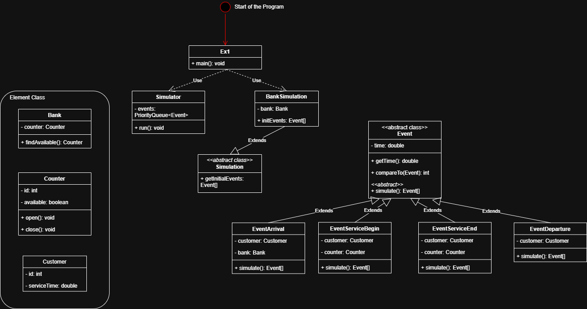

# Exercise 1 - Simulation 1

## Background

In this exercise, we are going to build a **discrete event simulator**. A **discrete event simulator** is a type of simulation where **state changes occur at discrete points in time**, rather than continuously. These changes are triggered by **events**, and the simulation progresses by handling one event at a time in chronological order.

## Code Structure

```
.
├── Bank.java
├── BankSimulation.java
├── Counter.java
├── Customer.java
├── Event.java
├── EventArrival.java
├── EventDeparture.java
├── EventServiceBegin.java
├── EventServiceEnd.java
├── Ex1.java
├── Simulation.java
└── Simulator.java
```

### Workflow



**Reading Input & Initializing Simulation**

* The program starts with `Ex1.main()`, which reads input using `Scanner`.
* It initializes a `BankSimulation` instance, which reads:
  * The number of customers
  * The number of service counters
  * A list of `(arrival time, service time)` pairs for each customer
* It creates **customer arrival events** and stores them in `initEvents`.



**Setting Up the Simulator**

* `new Simulator(simulation).run();` creates a `Simulator` instance.
* The `Simulator` **adds all initial events to a priority queue**.
* The events are **sorted by time**, ensuring that the earliest event is processed first.



**Processing Events (Simulator** `run()`**)**

* The simulator retrieves and processes **the earliest event** from the queue.
* It **prints** the event.
* It **simulates** the event, which may generate new events (e.g., a customer arriving and requesting service).
* These **new events** are added back into the priority queue.
* The process repeats **until the queue is empty**.


The use of the priority queue  determines the sequence of processing the events.




#### Example

Input:

```
3 1
1.1 2.0
2.2 2.0
3.3 2.0
```

**Meaning:**

* **3 customers** will arrive at the bank.
* **1 service counter** is available.
* **Customers' arrival times and service times:**
  * Customer 0 arrives at **1.1** and needs **2.0** time units of service.
  * Customer 1 arrives at **2.2** and needs **2.0** time units of service.
  * Customer 2 arrives at **3.3** and needs **2.0** time units of service.

Output:

```
1.100: Customer 0 arrives
1.100: Customer 0 service begin (by Counter 0)
2.200: Customer 1 arrives
2.200: Customer 1 departed
3.100: Customer 0 service done (by Counter 0)
3.100: Customer 0 departed
3.300: Customer 2 arrives
3.300: Customer 2 service begin (by Counter 0)
5.300: Customer 2 service done (by Counter 0)
5.300: Customer 2 departed
```

**Breakdown**:



**At t = 1.100**

* **Customer 0 arrives.**
* **Counter 0 is available**, so Customer 0 **immediately starts service**.
* **New Event Generated:** Customer 0 will **finish service at 3.100**.



&#x20;**At t = 2.200**

* **Customer 1 arrives.**
* However, **Counter 0 is busy serving Customer 0**, and **there is no waiting queue** in this model.
* **Customer 1 departs immediately** without being served.



**At t = 3.100**

* **Customer 0 finishes service at Counter 0.**
* **Customer 0 departs.**
* **Counter 0 becomes available.**



**At t = 3.300**

* **Customer 2 arrives.**
* **Counter 0 is now free**, so Customer 2 **immediately starts service**.
* **New Event Generated:** Customer 2 will **finish service at 5.300**.



**At t = 5.300**

* **Customer 2 finishes service at Counter 0.**
* **Customer 2 departs.**
* **Counter 0 becomes available, but no more customers are arriving.**



## OOP Design

### Class Relationship Diagram

<figure><figcaption></figcaption></figure>

### Tips

1. Use the [#single-responsibility-principle](../lab/lab-02-interface-wrapper-class-exercise-1-2.md#single-responsibility-principle "mention") that each class should **only be responsible for doing one single thing** to design the class.
2. `findAvailableCounter()` can return the `counter` instance.
3. When designing, you can image this IRL, when u walk into a bank, someone points you to which counter to go to, but after that all interactions are between you and the counter, the bank doesn't handle them anymore.
