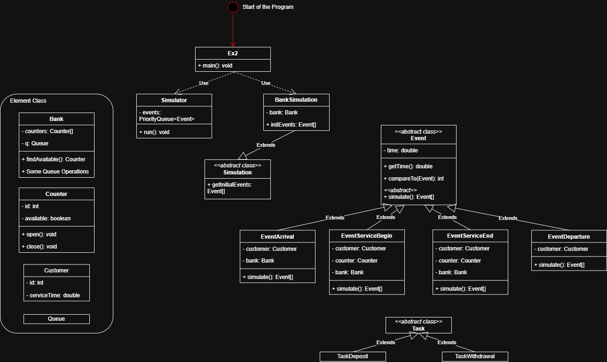

# Exercise 2 - Simulation 2

## Background

This exercise is built on [exercise-1-simulation-1.md](exercise-1-simulation-1.md "mention"). And the following are the things you should do:

1. Add a `queue` field in the bank to store the bank queue.
2. Add a `Task` abstract class, with two concrete classes extending from `Task` to represent the `DepositTask` and `Withdrawal Task` respectively.
3. Change the **operating logic** and **printing content** of some `Event`s

### OOP Design

### Class Relationship Diagram

<figure><figcaption></figcaption></figure>

Basically, the UML is quite similar to the Ex1's. The "difficult" point lies in finding the correct logic to trigger each event.
