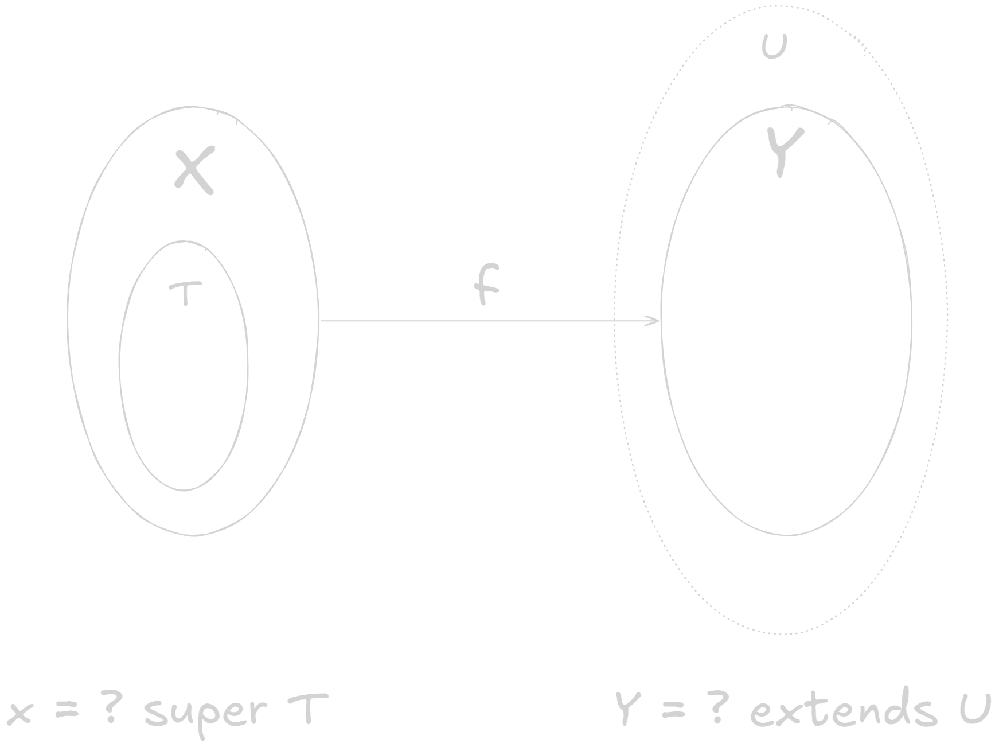

# Lab 04 - Wildcard,Nested Class, Java package

## Wildcard

The goal of wildcard in Java is to make generics **covariant**.

### Set notation

* Upper bounded wildcard (`? extends T`): It represents a **set** of type $$X$$, where $$X$$ is the **subtype of** `T`**.** $$\{X:X<T\}$$
* Lower bounded wildcard (`? super T`): It represents a **set** of type $$Y$$, where $$Y$$ is the **supertype of** `T`**.** $$\{Y:T<Y\}$$

A **classic problem** is to **find the range of a type parameter given a series of wildcards**. (This is to determine which type you should declare a variable to to be safe to hold the element you get from a sequence).

The **classic solution** is to **solve a system of inequalities**.

### Classic Examples

In [exercise-4-box.md](../exercises/exercise-4-box.md "mention"), we have a method called `Transformer<X, Y>` which represents a **unary transformation** $$f:X\to Y$$. This question actually requires us to **find the most relaxed bounds** for $$X$$ and $$Y$$. To do so, let's try the method of **solving the inequalities**:

1. $$f$$ should be able to "eat" everything of type `T`, so `X:>T`.
2. The **range** of $$f$$ should be a subset of `U`, so `Y<:U`.
3. Therefore, we should write `Transformer<? super T, ? extends U>`.

<figure><figcaption></figcaption></figure>

### Methods take in reference type as argument

When you write a method with arguments being a **reference type** `f(Object o)`, always check whether `o` is equal to `null` at first!

## Functional Programming

A classic way to describe a **function** $$f：x\mapsto f(x)$$. This means that if our function $$f$$ is **deterministic**, the previous formula is saying: **if you fix a function** $$f$$ **and supply it with any** $$x$$, $$f$$ **can always find the correct** $$y$$.

But we can also say it another way: **if you fix a "seed"** $$x$$ **and supply it with any deterministic function** $$f$$, $$x$$ **can always find its image** $$y$$, **through** $$f$$.

So, there's nothing stopping us from writign $$f(x)=y$$ as $$x(f)=y$$.


But notice the change in mindset here: instead of throwing an $$x$$ into $$f$$ and let $$f$$ do its work, we now **ask** $$x$$ **to use some** $$f$$ **to mutate itself**. (This is the basic of **functional programming!)**


To put it simply, our **starting point** changes from the **function** $$f$$ to **argument** $$x$$.

## Java package

In Java, a **package** is a way to group **closely related classes** together. Usually, classes in the same package have high dependency
&#x20;among one another and contain logic/data for performing
&#x20;a specific type of tasks.

For example, `java.io` is a package containing all classes
&#x20;related to IO, and `java.util`contains many utility data
&#x20;structures. (Useful in CS2040S).


A package needs to be **imported** before its classes can be
&#x20;used. This help to **keep irrelevant classes invisible** to
&#x20;simplify development process.


### default access modifiers


When used as access modifiers, `default` doesn't need to be **explicitly stated**.


When a class/field/method has **no access modifier**, it’s
&#x20;said to have `default` accessibility: it can be accessed by
&#x20;**any member from the same package**.

Classes not belonging to any package are put into the **default package** by Java. This is why for the previous exercises, not having access modifiers is equivalent to being `public` (for class/fields/methods).

### `protected` access modifiers

The `protected` means being accessible by **any member from the same package** and **child classes outside the package**.

## Nested Class

In practice, the use of nested class is called the **discriminated union.** This is a design of having an **abstract parent class** with a few **sealed inner classes**. And its use cases are:

1. An instance of the parent class is **always one of the few subtypes**.
2. Each subtype consists of **exactly the same functionalities** of the parent
   &#x20;class.
3. The behaviours between different subtypes are **mutually exclusive**. In other words, the behaviour of the parent class is completely **partitioned**
   &#x20;into **disjoint cases**.


This design actually utilises **polymorphism**.


For example,


```java
abstract class Box {
    // Abstract method that all subclasses must implement
    public abstract String doSomething();

    // Factory method to create a Box instance based on some runtime condition
    public static Box createBox(int discriminator) {
        switch (discriminator % 4) { // Simple runtime selection logic
            case 0:
                return new Case1();
            case 1:
                return new Case2();
            case 2:
                return new Case3();
            case 3:
                return new Case4();
            default:
                throw new IllegalArgumentException("Invalid discriminator");
        }
    }

    // Inner subclass 1
    private static class Case1 extends Box {
        @Override
        public String doSomething() {
            return "Implementation 1: Small Box";
        }
    }

    // Inner subclass 2
    private static class Case2 extends Box {
        @Override
        public String doSomething() {
            return "Implementation 2: Medium Box";
        }
    }

    // Inner subclass 3
    private static class Case3 extends Box {
        @Override
        public String doSomething() {
            return "Implementation 3: Large Box";
        }
    }

    // Inner subclass 4
    private static class Case4 extends Box {
        @Override
        public String doSomething() {
            return "Implementation 4: Extra Large Box";
        }
    }
}

class Main {
    public static void main(String[] args) {
        // User code: only interacts with Box type at compile time
        Box box1 = Box.createBox(0); // Runtime: Case1
        Box box2 = Box.createBox(1); // Runtime: Case2
        Box box3 = Box.createBox(2); // Runtime: Case3
        Box box4 = Box.createBox(3); // Runtime: Case4

        // Polymorphism in action: correct implementation called at runtime
        System.out.println(box1.doSomething()); // Output: "Implementation 1: Small Box"
        System.out.println(box2.doSomething()); // Output: "Implementation 2: Medium Box"
        System.out.println(box3.doSomething()); // Output: "Implementation 3: Large Box"
        System.out.println(box4.doSomething()); // Output: "Implementation 4: Extra Large Box"

        // Example with a runtime variable
        int runtimeValue = (int) (System.currentTimeMillis() % 4); // Dynamic condition
        Box result = Box.createBox(runtimeValue);
        System.out.println("Dynamic result: " + result.doSomething());
    }
}
```

