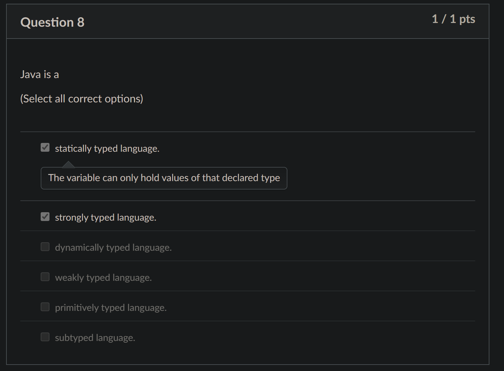
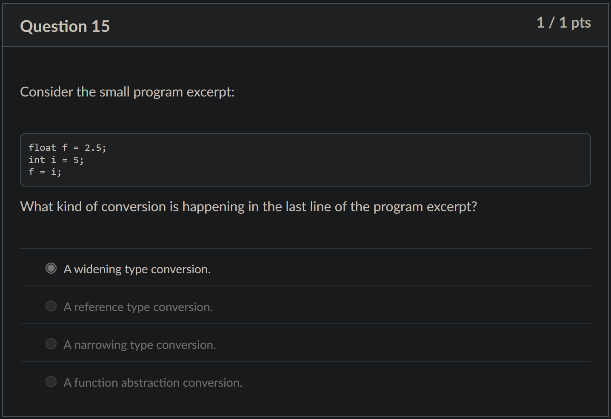

# Diagnostic Quiz

## Problems

### Q8. Statically, Dymically, Strongly or Weakly Typed Language

<figure><figcaption></figcaption></figure>

Java is:



#### **Statically typed**

This means _the variable can only hold values of the declared type._



#### **Strongly typed**

This means everything needs to make sense, a.k.a if there are any problems with the program, it is not due to the type. For example, _no implicit **narrowing** conversion is allowed_


```java
int x = 10;
double y = 3.14;
int z = x + y; // Error: Cannot directly add double to int without casting
```


This code snippet will generate a **compilation error**.



### Q15. Widening/Narrowing type conversion

_Java allows a variable of type_ $$T$$ _to hold a value from a variable of type_ $$S$$ _only if_ $$S<:T$$. This step is called _**widening type conversion**_.

The term "widening" is easy to see for primitive types — the subtype has a narrower range of values than the supertype. The **opposite** conversion is called _**narrowing**_ because the size is narrower.

<figure><figcaption></figcaption></figure>

In this problem `i` is `int` and `f` is float, and `int <: float`, so `f = i` is a _widening type conversion_. For this question, we can get two tips as follows:&#x20;

* Java is a **strongly typed language**, but it allows _widening type conversion_ and will do this automatically **without explicit casting**.
* However, _narrowing type conversion_ without explicit casting is **not** allowed in Java. (WHY? Prof said will find out in future lec)

## Tips

1. Java is a **strongly typed language**, but it allows _widening type conversion_ and will do this automatically **without explicit casting**.
2. However, _narrowing type conversion_ without explicit casting is not allowed in Java.
