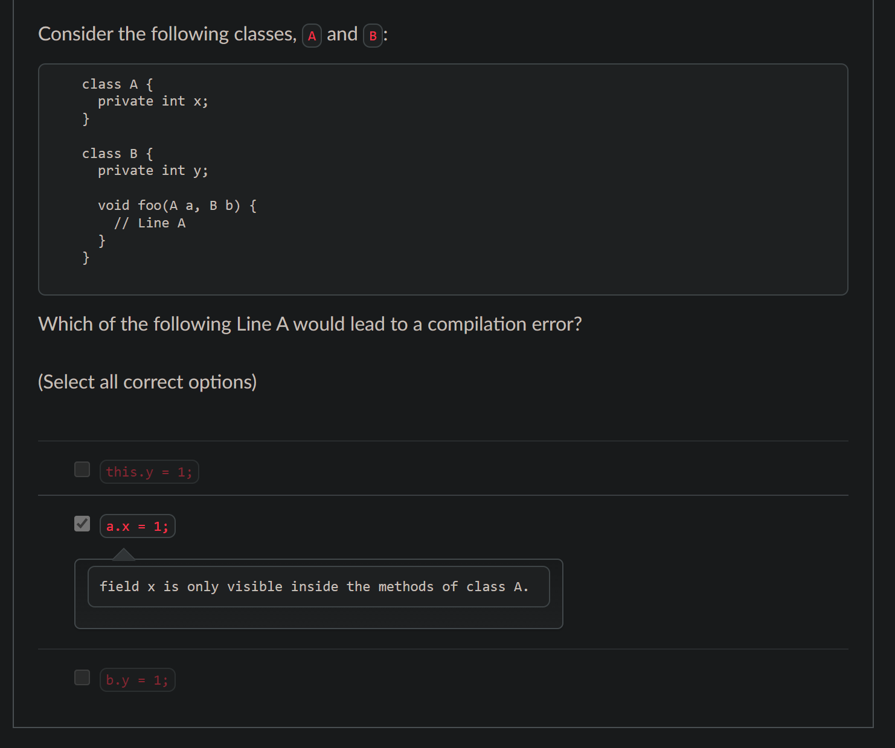

# Diagnostic Quiz

## Problems

### Q2. More on `private`

<figure><figcaption></figcaption></figure>

The first two options are relatively easy to analyze, the problem lies in the third option `b.y=1` and this is valid because `foo` belongs to class `B`, and thus has access to `y` of any instance of `B`.

Private fields are accessible to **all methods within the same class**, **regardless of which instance is being accessed.**

### Q8. Subtype and Inheritance

Given the following code,


```java
class P {
}

class Q extends P {
}

class R extends Q {
}
```


1. The **inheritance relationship** we can get is $$P>Q>R$$ (Here, let's denote $$a>b$$ as " $$a$$ is the parent of $$b$$.)
2. Then from the inheritance relationship, we should get this **subtype relationship** $$P:>Q>:R$$. And then use the basic knowledge of **combinatorics**, we know there will be 3 possible answers.

### Q11. `this` and class method

Given the following code,


```java
class Test {
   private int number = 2;

   public static int getNumber() {
     return this.number;
   }
}
```


Firstly, we notice that the method `getNumber()` is `static`. According to our learning in [class method](./#class-method), we should deduce that the `getNumber()` method is **associated to the class**, instead of any instance from the class.

Also, in our learning, we know that a class method **cannot** **access its instance fields or call other of its instance methods**, and one corollory of this is that the keyword `this` is also not allowed in a class method (This is also [covered](./#more-on-this) in the lecture notes).

### Q12. `main()` method

Same as we have seen in the [lecture notes](./#the-main-method), the `main()` method must be declared as the following:


```java
public static final void main(String[] args) {
}
```


### Q13. Method Signature and Descriptor

For this problem, refer back to the lecture ntoes about [_method signature_ and _method descriptor_](./#method-signature-and-descriptor).

### Q15. Overriding and Overloading


I will leave it when I learn Overloading.


## Tips

1. Private fields are accessible to **all methods within the same class**, **regardless of which instance is being accessed**.
2. Suppose we have two classes $$P$$ and $$Q$$, if $$Q$$ inheritates from $$P$$, then we can say $$Q$$ is the **subtype** of $$P$$ or $$P:>Q$$.
3. A class method (method with the keyword `static`) **cannot** **access its instance fields or call other of its instance methods**, and one corollory of this is that the keyword `this` is also **not allowed** in a class method. Otherwise, a **compilation-error** will be generated.
4. Include the _method signature_ and _method descriptor_ in the cheatsheet!
