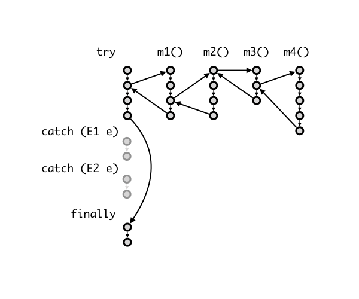
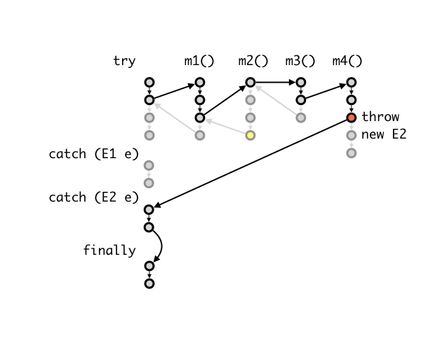

# Lec 04 - Exception and Wrapper Classes

## Wrapper Class

In the previous [lec](lec-03-polymorphism/), we have introduced how to write general code on **reference type** by using _polymorphism_. Then, how about the **primitive type**? How do we write general code for the primitive type (a.k.a make primitive types less primitive)? Here it comes — The Wrapper class.


Another reason to use _Wrapper Class_ is that `int[]` **cannot** be converted to `Obj[]` automatically.


***

A _wrapper class_ is a class that encapsulates a _type_. For example, the wrapper class for `int` is called `Integer`, for `double` is called `Double`, etc. The table for the wrapper class for all primitive types in Java is summarised as follows:

| Primitive | Wrapper     |
| --------- | ----------- |
| `byte`    | `Byte`      |
| `short`   | `Short`     |
| `int`     | `Integer`   |
| `long`    | `Long`      |
| `float`   | `Float`     |
| `double`  | `Double`    |
| `char`    | `Character` |
| `boolean` | `Boolean`   |

In particular, the wrapper class is considered as _reference type_ and their instances can be created with `new` and stored on the heap.


All primitive wrapper class objects are _immutable —_ once you create an object, it cannot be changed.


### Conversion between primitive types and its wrapper class

This is known as _auto-boxing_ and _unboxing._



**Auto-boxing**

This is used when you convert a primitive type to its wrapper class.


```java
Integer i = 4;
```


Here, the primitive value of `int` 4 is converted into an _instance_ of `Integer`.


Auto-boxing **doesn't** work for complex types, like Array. So, Java cannot convert `int[]` to `Integer[]`.




**Unboxing**

This is used when you convert an _instance_ of a wrapper class to its primitive type.

<pre class="language-java" data-line-numbers><code class="lang-java">Integer i = 4;
<strong>int j = i;
</strong></code></pre>

Line 2 converts an instance of `Integer` back to `int`.




Both auto-boxing and unboxing are implemented automatically.


### Performance

For the sake of general code and polymorphism, why don't we use _wrapper class_ all the time? The reason is **performance**. Using primitive types is **faster** than using its _wrapper class_ since the latter needs to instantiate an object every time it is being used.

## Run-Time Class Mismatch

The main point of this part is about **when explicit casting will be successful**?

***

**Explicit casting** is usually done during the _narrowing type conversion_ process, which is happened during the **run-time**, and as the name suggests, the type must be "narrowed down". So, for an **explicit casting** to be successful, the two types must have a **subtype relationship**.

### Run-Time error or compile-time error?

When doing type casting, if the **compile-time type** of the two objects have **no** subtype relationship, then a **compile-time error** will be generated.

On the other hand, a **run-time error** will be generated when there is **no** subtype relationship between the **run-time** **type** of the two objects you are operating on.

## Variance

Till now, we have seen the **subtype relationship** on classes and interefaces, this is trivial. However, how about the _complex types_ such as arrays? Seems that the subtype relationship is not that trivial. So, here it comes — the principle of _variance of types_:

> The _variance of types_ refers to how the **subtype relationship** between _complex types_ relates to the subtype relationship between [_components_](#user-content-fn-1)[^1].

### Variance of types

Let $$C(S)$$ correspond to some **complex type** based on type $$S$$, which means $$C(S)$$ is the type of the array and $$S$$ is the type of each element/component in the array. We say a complex type is:

* _covariant:_ which means if $$S<:T$$, then $$C(S)<:C(T)$$
* _contravariant:_ which means if $$S<:T$$, then $$C(T)<:C(S)$$
* _invariant_: if it is neither covariant nor contravariant


Java Array is **covariant**.


## Exceptions

### `try`-`catch`-`finally` block

In Java, we use `try`-`catch`-`finally` block in our process to handle exceptions. Their usage is summarised as follows:


```java
try {
  // do something
} catch (an exception parameter) {
  // handle exception
} finally {
  // clean up code
  // regardless of there is an exception or not
}
```


#### Compile-error in `catch` block

In the `catch` block, the first catch block that has an exception type compatible with the type of the thrown exception (i.e. a subtype) is selected to handle the exception. So, if there are multiple avialable blocks, the compiler will generate a **compile-time error**.

### Throwing Exceptions

We can control our program to throw an exception when our program doesn't behave as we expect. To throw an exception, we need to:

1. use the keyword `throw` (not `throws`)
2. create a new exception object and throw it to the caller. (e.g. `IllegalArgumentException("radius cannot be negative.")`)

For example, the complete Java code should be as follows:


```java
  if (r < 0) {
    throw new IllegalArgumentException("radius cannot be negative.");
  }
```


### Checked vs. Unchecked Exceptions

An _unchecked exception_ is an exception caused by a programmer's errors. They should not happen if perfect code is written. `IllegalArgumentException`, `NullPointerException`, `ClassCastException` are examples of unchecked exceptions. Generally, unchecked exceptions are **not** explicitly caught or thrown. They indicate that something is wrong with the program and cause **run-time errors**.

A _checked exception_ is an exception that a programmer has **no control** over. Even if the code written is perfect, such an exception might still happen. The programmer should thus actively anticipate the exception and handle them. For instance, when we open a file, we should anticipate that in some cases, the file cannot be opened. `FileNotFoundException` and `InputMismatchException` are two examples of is an example of a checked exception. A checked exception must be either handled, or else the program **will not compile**.


In Java, unchecked exceptions are subclasses of the class `RuntimeException`.


An unchecked exception, if not caught[^2], will propagate automatically down the stack until either it is caught or if it is not caught at all, resulting in an error message displayed to the user.

A checked exception, however, must be handled. And this is done by either handling it in the calling method, or handling it in the caller. Below is an example regarding handling the `FileNotFoundException`)



**Handle in the called method**

<pre class="language-java" data-line-numbers><code class="lang-java">class Main {
  static FileReader openFile(String filename) {
<strong>    try {
</strong>      return new FileReader(filename);
<strong>    } catch (FileNotFoundException e) {
</strong><strong>      System.err.println("Unable to open " + filename + " " + e);
</strong><strong>    }
</strong>  }
  public static void main(String[] args) {
    openFile();
  }
}
</code></pre>



**Handle in the calling method**

<pre class="language-java" data-overflow="wrap" data-line-numbers><code class="lang-java">class Main {
<strong>  static FileReader openFile(String filename) throws FileNotFoundException {
</strong>    return new FileReader(filename);
  }
  public static void main(String[] args) {
<strong>    try {
</strong>      openFile();
<strong>    } catch (FileNotFoundException e) {
</strong><strong>      // warn user and pop up dialog box to select another file.
</strong><strong>    }
</strong>  }
}
</code></pre>

Line 2 is a **method declaration** which indicates that the method `openFile()` **may** throw a `FileNotFoundException`.




_A good program always handles checked exception gracefully_ and hides the details from the users.


### Control Flow of Exceptions

The use of Exceptions can affect the control flow of our program. For example, with the code following


```java
try {
    m1();
} catch (E1 e) {
    :
} catch (E2 e) {
    :
} finally {
    :
}

void m1() {
    :
    m2();
    :
}

void m2() {
    :
    m3();
    :
}

void m3() {
    :
    m4();
    :
}

void m4() {
    :
    // throw new E2();
    :
}
```


Our normal control flow is as follows,

<figure><figcaption></figcaption></figure>

Then, what if we have thrown an exception `E2` inside the `m4()`? (We decomment the Line 31 in the code above). Then, our control flow will become:

<figure><figcaption></figcaption></figure>


Note that the `finally` block is always executed even when `return` or `throw` is called in a `catch` block.


### Good Practices for Exception Handling

#### Catch Exceptions to Clean Up <a href="#catch-exceptions-to-clean-up" id="catch-exceptions-to-clean-up"></a>

In the example, we may notice that if we have allocated some resources in `m2()` or `m3()`, they might not be deallocated because of the control flow of our exception handling.

So, it is recommended to handle the exception in the **called method** itself by using another `try-catch-finally` block. And if you still feel a need to pass the exception to the calling method, you can also do it by throwing this exception again in the `catch` block. For example,


```java
public void m2() throws E2 {
  try {
    // setup resources
    m3();
  }
  catch (E2 e) {
    throw e;
  }
  finally {
    // clean up resources
  }
}
```


[^1]: or "elements" if you are from CS1010, which uses C as the teaching language.

[^2]: here "catch" means the exception being handled.
