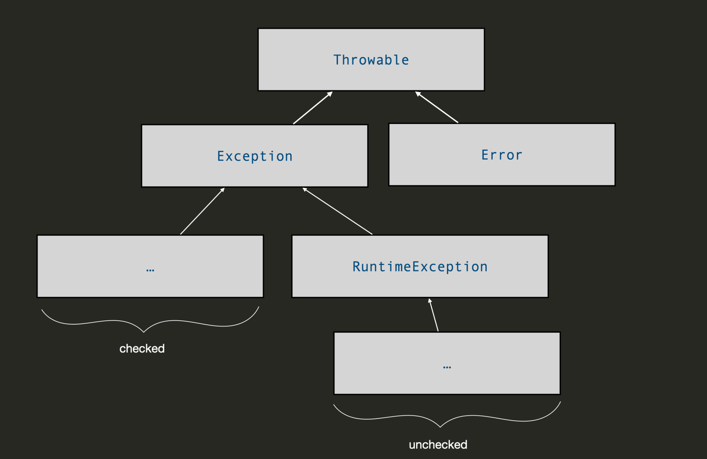

# Diagnostic Quiz

## Problems

### 01. Subtype relationship with `interface`

> Pay attention to the _reflexive_ property of the subtype relationship. This willl ensure you get **all** the correct options! Don't miss one!

That is, if $$A<:B$$ and $$B<:C$$, then $$A<:C$$

### 02. Type casting and compile-time error

> To see whether a code will generate compile-error or not, we **only** see the CTT of the variable and the type casting.

Type casting will cast the variable to that specific type during the compile-time.

### 03. Type casting and rum-time error

> Run-time error judgement **only** needs us to see the RTT of the variable and whether the type casting follows the subtype relationship.

### 04. Wrapper class

> All primitive wrapper class objects are _immutable._

This means that **once a wrapper object is created, its value cannot be changed**. If you want to modify the value, you have to create a new object.


```java
public class WrapperImmutability {
    public static void main(String[] args) {
        Integer a = 10; // Autoboxing: int → Integer

        // Trying to "modify" a
        a = a + 5; // This creates a NEW Integer object
    }
}
```


### 14. Exception Hierarchy

The following image summarise the Exception Hierarchy well!

<figure><figcaption></figcaption></figure>

### 16. `throw` as `return`

In the `try-catch-finally` exception handling block, the `throw` statement has the same purpose as `return`, meaning that it will `jump` directly from the current block and may enter the next block.

For example, the following code will print `BD` at the end.


```java
try {
   throw new NewException();
   System.out.print("A");
} catch (NewException e) {
   System.out.print("B");
} catch (OldException e) {
   System.out.print("C");
} finally {
   System.out.print("D");
}
```


## Tips

1. Pay attention to the _reflexive_ property of the subtype relationship. This willl ensure you get **all** the correct options! Don't miss one!
2. To see whether a code will generate **compile-error** or not, we **only** see the **CTT** of the variable and the type casting.
3. **Run-time error** judgement **only** needs us to see the **RTT** of the variable and whether the type casting follows the subtype relationship.
4. Include the exception hierarchy in the cheatsheet!
