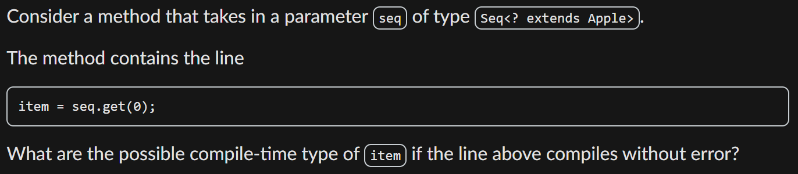
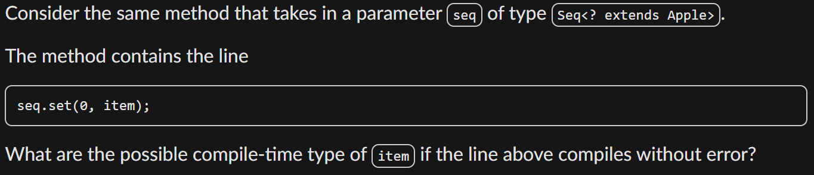
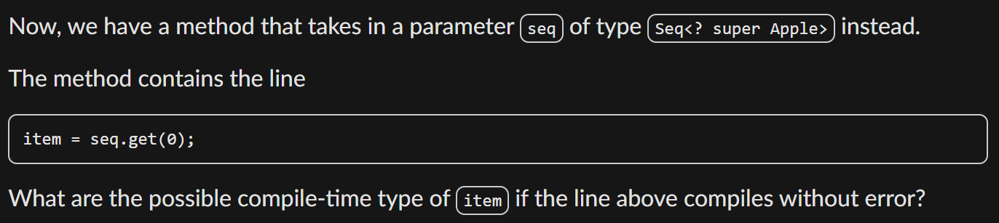
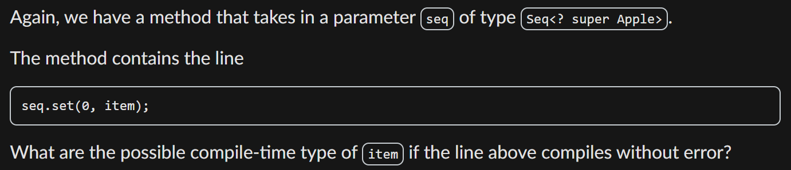
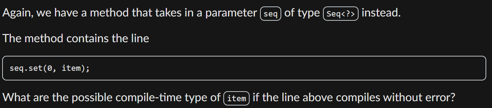
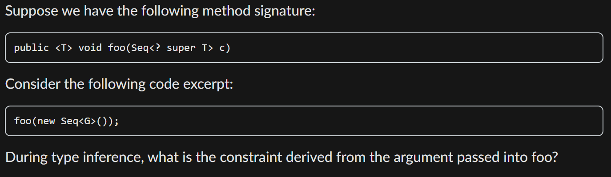

# Diagnostic Quiz

## Problems

For questions 4,5,7,8,11, we are given three classes, `Gala`,  `Apple`, and `Fruit`, with `Gala` <: `Apple` <: `Fruit`, along with the class `Seq<T>` that we have developed in the lecture and notes.

### 04. CTT with Producer using upper-bounded wildcard

<figure><figcaption></figcaption></figure>

`seq.get(0)` may produce any type which is the subtype of `Apple`. So, to ensure the code compiles, the CTT to `item` must be any supertype of `Apple` (including `Apple`). Thus, the correct options are:

1. `Apple`
2. `Fruit`
3. `Object`

### 05. CTT with Consumer using upper-bounded wildcard

<figure><figcaption></figcaption></figure>

`seq.set(0, item)` needs the type of `item` to be the subtype of type of the element in the `seq`, which must be any subtype of `Apple`. Since the type of the element is **not decided** during the compile-time, we can only put `null` into `seq`! Tricky ah :cold\_sweat:

### 07. CTT with Producer using lower-bounded wildcard

<figure><figcaption></figcaption></figure>

Similar analysis as in [#id-04.-ctt-with-producer-using-upper-bounded-wildcard](diagnostic-quiz.md#id-04.-ctt-with-producer-using-upper-bounded-wildcard "mention"), here `seq.get(0)` will return the type that is any **supertype** of `Apple` and for this code to be compilable, the type of `item` can only be `Object`!

### 08. CTT with Consumer using lower-bounded wildcard

<figure><figcaption></figcaption></figure>

Similar analysis to [#id-05.-ctt-with-consumer-using-upper-bounded-wildcard](diagnostic-quiz.md#id-05.-ctt-with-consumer-using-upper-bounded-wildcard "mention"), here the `seq.set(0, item)` requires the type of `item` to be the **subtype** of the type of each element in `seq`. Since the type of each element in `seq` is of any **supertype** of `Apple`, thus the available type options for `item` here should be:

1. `Gala`
2. `Apple`

### 11. CTT with Consumer using unbounded wildcard

<figure><figcaption></figcaption></figure>

Similar analysis to [#id-07.-ctt-with-producer-using-lower-bounded-wildcard](diagnostic-quiz.md#id-07.-ctt-with-producer-using-lower-bounded-wildcard "mention"), here the type of `item` must be **subtype** of each element in the `seq`. Since the type of each element in `seq` is **unknown** during the compile time, thus only `null` can be put into `seq`!

### 13. Type Inference

For this question, consider this background


```java
interface I {
}

class H implements I {
}

class G extends H {
}
```


along with the `Seq<T>` class we developed in the lecture/notes.

<figure><figcaption></figcaption></figure>

Use the [#rule-of-thumb](./#rule-of-thumb "mention") of Type Inference we have leanred in Lec 06, the only one that is applicable here is the **Argument**. So, our constraint will be

1. `Seq<G>` <: `Seq<? super T>`

## Tips

1. Practice makes perfect!
