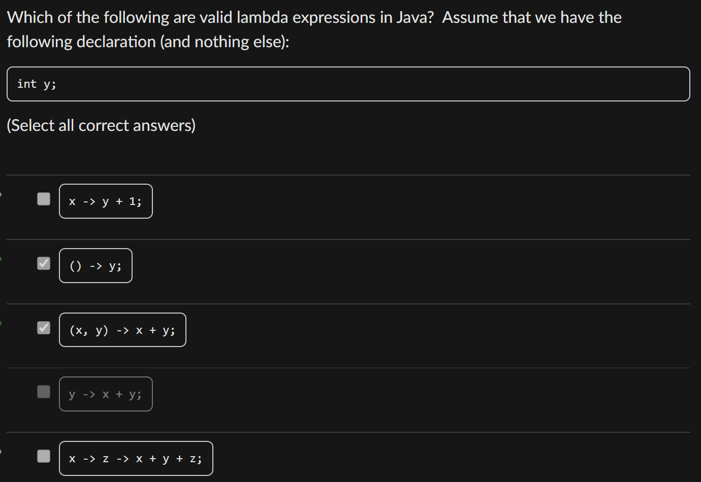

# Diagnostic Quiz

## Problems

### 1. Pure Functions

> Pure functions can take in **no** input, but every time they are given the same input, we must get the same output!

For example, the following is not a **pure function** because it doesn't give us the same **output** every time we call the function.

```java
public long foo() {
  // Returns the current time in milliseconds. 
  return System.currentTimeMillis(); 
}
```

### 2. Functional Interface

> A functional interface must have **exactly one abstract method**, **no field** is allowed!

### 4. Variable Capture in Lambda Expression

> The lambda can only use variables that are either its own parameters (e.g., `x` in `x -> ...`) or variables in scope (like `y` in this case, this is done by variable capture).

<figure><figcaption></figcaption></figure>

In Java, lambda expressions can "capture" variables from their enclosing scope, meaning they can use variables that are not defined as parameters of the lambda itself. However, there are strict rules for how this works:

1. **Instance or Static Variables**: Lambda expressions can freely capture instance or static variables of the enclosing class without restrictions.
2. **Local Variables**: If a lambda captures a local variable (a variable declared in the enclosing method), that variable must be **effectively final**. This means the variable must either be explicitly marked as final or must not be modified after its initialization.
3. **Parameters of the Lambda**: Variables declared as parameters of the lambda (e.g., `x` in `x -> ...`) are local to the lambda and can be used freely within its body.
4. **Shadowing**: If a lambda parameter has the same name as a variable in the enclosing scope, the lambda parameter "shadows" the outer variable, meaning the lambda uses its own parameter instead of the outer variable.

An example code is shown as follows:


```java
import java.util.function.Function;
import java.util.function.Supplier;
import java.util.function.BiFunction;

public class LambdaCaptureExample {
    // Instance variable (like the `int y;` in the question)
    int y = 10;

    public void demonstrateCapture() {
        // Local variable that is effectively final
        final int localZ = 5;

        // Local variable that is effectively final (not modified after initialization)
        int localW = 20;

        // Local variable that is NOT effectively final (will cause an error if captured)
        int localX = 30;
        localX++; // Modifying localX makes it not effectively final

        // 1. Lambda capturing instance variable `y` (valid)
        // This is similar to `x -> y + 1` from the question
        Function<Integer, Integer> lambda1 = x -> y + 1;
        System.out.println("Lambda1 (x -> y + 1) with x = 5: " + lambda1.apply(5)); // y = 10, so 10 + 1 = 11

        // 2. Lambda capturing instance variable `y` with no parameters
        // This is similar to `() -> y;` from the question
        Supplier<Integer> lambda2 = () -> y;
        System.out.println("Lambda2 (() -> y): " + lambda2.get()); // y = 10, so returns 10

        // 3. Lambda using its own parameters, shadowing `y`
        // This is similar to `(x, y) -> x + y;` from the question
        BiFunction<Integer, Integer, Integer> lambda3 = (x, y) -> x + y;
        System.out.println("Lambda3 ((x, y) -> x + y) with x = 3, y = 4: " + lambda3.apply(3, 4)); // 3 + 4 = 7
        // Note: The `y` in the lambda parameters shadows the instance variable `y`

        // 4. Lambda capturing a local variable (valid because localZ is effectively final)
        Function<Integer, Integer> lambda4 = a -> a + localZ;
        System.out.println("Lambda4 (a -> a + localZ) with a = 2: " + lambda4.apply(2)); // localZ = 5, so 2 + 5 = 7

        // 5. Lambda capturing a local variable (valid because localW is effectively final)
        Function<Integer, Integer> lambda5 = b -> b + localW;
        System.out.println("Lambda5 (b -> b + localW) with b = 3: " + lambda5.apply(3)); // localW = 20, so 3 + 20 = 23

        // 6. Lambda capturing a local variable (INVALID because localX is not effectively final)
        // This will cause a compilation error if uncommented
        // Function<Integer, Integer> lambda6 = c -> c + localX; // Error: "local variables referenced from a lambda expression must be final or effectively final"
    }

    public static void main(String[] args) {
        LambdaCaptureExample example = new LambdaCaptureExample();
        example.demonstrateCapture();
    }
}
```


### 6. Stack and Heap with Variable Capture in Lambda Expression

### 9. Function Interface Implementation with Method Reference

## Tips
