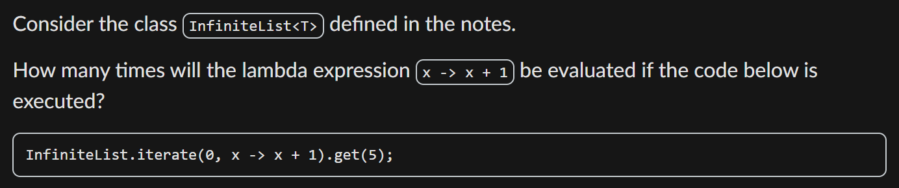

# Diagnostic Quiz

## Problems

### 6. How many times will an lambda be evulated in an Infinite List

> If you call `get(n)`, the the lambda expression in the `itearte()` will be ecaluated `n` times!

<figure><figcaption></figcaption></figure>

Since `get(n)`, and `n` is 5, the lambda expression will be evaluated 5 times!

### 8-11. Use Heap Diagram to trace the program

> 1. When you call `infiList1 = InfiniteList.operation`, the `head`  and `tail` fields in the `infiList1` point to two **anonymous classes** implemented in lambdas which **capture** the variable appeared in that **lambda**.
> 2. When you call `infiList2 = infiList1.opeartion`, the `head` and `tail` fields in teh `infiList2` point to two **anonymouse classes** also, but with another `this` field in each of them, which points to `infiList1`.
> 3. Also include the code, the implementation for some `InfiniteList` operations and pictures from the lecture into the Cheatsheet!

Given this modified version of `InfiniteList::map`,


```java
public <R> InfiniteList<R> map(Transformer<? super T, ? extends R> mapper, int tag) {
  System.out.print(tag + " ");
  InfiniteList<R> list = new InfiniteList<>(
      () -> mapper.transform(this.head()),
      () -> this.tail().map(mapper, tag + 1));
  System.out.print(tag + " ");
  return list;
}
```


What will be printed by the code snippet below?


```java
InfiniteList.iterate(0, x -> x + 1)
    .map(x -> x + 1, 7)
    .map(x -> x * 2, 20)
    .get(1);
```


This question is a bit tedious, but the stack and heap diagram should be easy to draw following the above rules. The answer is `7 7 20 20 8 8 21 21`.

### 13. Infinite Loop in Stream

> 1. `sorted()` and `distinct()` should only be called on **finite** streams. Otherwise, the program will enter an infinite loop.

## Tips

1. When calling `get(n)` in EagerList or InfiniteList, notice the the index of the element in the list starts from 0!
2. **Stack and Heap Diagram for Infinite List Rules of thumb**
   1. When you call `infiList1 = InfiniteList.operation`, the `head`  and `tail` fields in the `infiList1` point to two **anonymous classes** implemented in lambdas which **capture** the variable appeared in that **lambda**.
   2. When you call `infiList2 = infiList1.opeartion`, the `head` and `tail` fields in teh `infiList2` point to two **anonymouse classes** also, but with another `this` field in each of them, which points to `infiList1`.
   3. Also include the code, the implementation for some `InfiniteList` operations and pictures from the lecture into the Cheatsheet!
3. `sorted()` and `distinct()` should only be called on **finite** streams. Otherwise, the program will enter an infinite loop.
