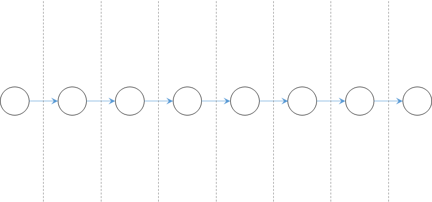
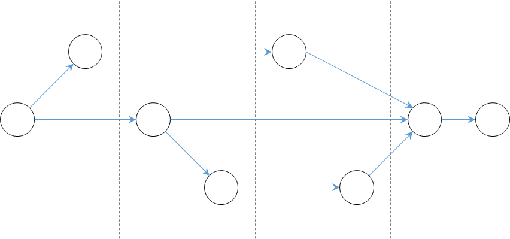
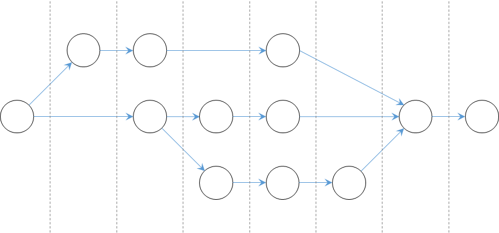

# Lec 10 - Monad and Parallel Stream

## Monad

At a high level, a **Monad** is a **design pattern** (from category theory) used in **functional programming** to **wrap values** and **chain computations** in a safe and composable way.

The follwing containers we have learned and implemented are all considered as **monad**.

| Container                                                             | Side-Information                                                                |
| --------------------------------------------------------------------- | ------------------------------------------------------------------------------- |
| `Maybe<T>`                                                            | The value might be there (i.e., `Some<T>`) or might not be there (i.e., `None`) |
| `Lazy<T>`                                                             | The value has been evaluated or not                                             |
| [`Loggable<T>`](https://nus-cs2030s.github.io/2425-s2/35-logger.html) | The log describing the operations done on the value                             |


**Side-Information** is any extra data or context that **accompanies the main value**, but isn't the value itself.


Each of these classes has:

* an `of` method to initialize the value and side information.
* have a `flatMap` method to update the value and side information.

The class may also have other methods besides the two above. Additionally, the methods may have different names.

***

More specifically, **monads** are the classes that we wrote can follow certain patterns that make them well-behaved when we create them with `of` and chain them with `flatMap`.


For ths sake of this course, we are only interested in deciding whether a **class/type** is a **monad** using the monad law or applying these laws to analyze the behavior of a **monad.**


### Monad Laws

Let `Monad` be a type that is a monad and `monad` be an instance of it, a Monad should following the following three laws,



**The left identity law**

`Monad.of(x).flatMap(x -> f(x))` must be the same as `f(x)`

Our `of` method should not do anything extra to the value and side information — it should simply wrap the value `x` into the `Monad`. Our `flatMap` method should not do anything extra to the value and the side information, it should simply apply the given lambda expression to the value.



**The right identity law**

`monad.flatMap(x -> Monad.of(x))` must be the same as `monad`

Since `of` should behave like an identity, it should not change the value or add extra side information. The `flatMap` above should do nothing and the expression above should be the same as `monad`.



**The associative law**

`monad.flatMap(x -> f(x)).flatMap(x -> g(x))` must be the same as `monad.flatMap(x -> f(x).flatMap(y -> g(y)))`

Regardless of how we group those calls to `flatMap`, their behavior must be the same.




A **Monad** helps us reason about our code!


## Functors

A **functor** is a simpler construction than a [monad](lec-10-monad-and-parallel-stream.md#monad) in that it only ensures **lambdas can be applied sequentially to the value**, without worrying about side information.


Recall that when we build our `Loggable<T>` abstraction, we add a [`map`](https://nus-cs2030s.github.io/2425-s2/35-logger.html#making-loggable-general) that only updates the value but changes nothing to the side information. One can think of a functor as an **abstraction that supports** `map`.


### Functor Laws

Let `Functor` be a type that is a functor and `functor` be an instance of it, a **functor** should following the following three laws,



**Identity Law**

`functor.map(x -> x)` is the same as `functor`



**Composition Law**

`functor.map(x -> f(x)).map(x -> g(x))` is the same as `functor.map(x -> g(f(x))`.




Our classes from `cs2030s.fp`, `Lazy<T>`, `Maybe<T>`, and `InfiniteList<T>` are **functors** as well.


<details>

<summary>Some Tips about <strong>Monad and Functors</strong></summary>

1. For a class/type to be a Monad, it must have
   1. Two methods: `of` and `flatMap` which does their corresponding jobs respectively
   2. Adhere to the three [#monad-laws](lec-10-monad-and-parallel-stream.md#monad-laws "mention")
2. For a class/type to be a Functor, it must have
   1. One method: `map` which does its job
   2. Adfere to the two [#functor-laws](lec-10-monad-and-parallel-stream.md#functor-laws "mention")
3. A class/type can be **both** monad and functor!
4. Every **Monad is a Functor**, But not every **Functor is a Monad**.

</details>

## Parallel Stream

### Prallel and Concurrent Programming



<figure><figcaption></figcaption></figure>

**Sequencity** means that at any one time, there is only one instruction of the program running on a processor.



<figure><figcaption></figcaption></figure>

**Concurrency** refers to the ability of a program to manage multiple tasks at the same time. Even on a single-core processor — where only one instruction can be executed at any moment (this is **sequencity**) — concurrency allows the program to switch between tasks quickly, giving the illusion that they are running simultaneously.

This is often achieved using **threads**, which are smaller units of a process. By dividing a program into multiple threads (e.g., one for handling user input, another for doing background work), the system can switch between them as needed. This improves responsiveness and efficiency, especially when some threads are waiting (like for I/O), allowing others to make progress in the meantime.



<figure><figcaption></figcaption></figure>

While concurrency gives the illusion of subtasks running at the same time, **parallel** computing refers to the scenario where multiple subtasks are truly running at the same time — either we have a processor that is capable of running multiple instructions at the same time, or we have multiple cores/processors and dispatch the instructions to the cores/processors so that they are executed at the same time.




1. All **parallel** programs are **concurrent**, but **not all concurrent** programs are **parallel**.
2. Modern computers have more than one core/processor. As such, the line between parallelism and concurrency is blurred.


### Parallel Stream

In Java, a **parallel stream** is a type of stream that allows you to process elements **concurrently** using multiple threads. It’s created by



**Calling** `.parallel()` **on a standard stream**

**Example**


```java
List<String> list = Arrays.asList("a", "b", "c", "d");
list.stream().parallel().forEach(System.out::println);

// Output (One possibility)
// c
// a
// b
// d
```


`.paralle()` is a **lazy operation** — it merely **marks** the stream to be processed in parallel. As such, you can insert `.parallel()`  anywhere in the pipeline **after the** **data source** and **before the** [**terminal operation**](lec-09-infinitelist-and-stream/#terminal-operations)**.**


`.sequential()`

There is a method `sequential()` which marks the stream to be process sequentially. If you call both `parallel()` and `sequential()` in a stream, **the last call "wins"**. The example below processes the stream sequentially:

```java
s.parallel().filter(x -> x < 0).sequential().forEach(..);
```




**Calling** `Stream.parallelStream()` **on a collection**

<pre class="language-java" data-line-numbers><code class="lang-java">List&#x3C;Integer> numbers = Arrays.asList(1, 2, 3, 4, 5, 6, 7, 8, 9, 10);

numbers.parallelStream()
       .map(n -> n * 2)
       .forEach(System.out::println);
       
// Output (One possibility)
<strong>// 14
</strong>// 12
// 16
// 20
// 2
// 18
// 8
// 4
// 6
// 10
</code></pre>



You may notice that the output is **reordered**.

1. This is because `Stream` has broken down the numbers into subsequences (more formally speaking, it is **spliting into multiple threads**), and run `forEach` for each subsequence in parallel.
2. Since there is no coordination among the parallel tasks on the order of the printing, **whichever parallel tasks that complete first will output the result to screen first**.
3. This causes the sequence of numbers to be **reordered**.

#### What can be parallelized

To ensure that the output of the parallel execution is correct, the [**stream operations**](#user-content-fn-1)[^1]



**must not&#x20;**_**interfere**_**&#x20;with the stream data**

**Interference** means that one of the stream operations modifies the source of the stream during the execution of the terminal operation. For instance:


```java
List<String> list = new ArrayList<>(List.of("Luke", "Leia", "Han"));
list.stream()
    .peek(name -> {
         if (name.equals("Han")) {
           list.add("Chewie"); // they belong together
         }
      })
    .forEach(i -> {});
```


would cause `ConcurrentModificationException` to be thrown. Note that this **non-interference rule** applies even if we are using `stream()` instead of `parallelStream()`.



**most of the time should be&#x20;**_**stateless**_


**Stateful** and **stateless** refer to the **stream operations!**


**Stateless operations** are stream operations where the processing of one element **does not depend** on elements processed before. For example, `map()`, `filter()`, `flatMap()` and `peek()` are **stateless.**


```java
Stream.of("a", "bb", "ccc")
      .map(s -> s.length()) // doesn't care what the previous or next element is
      .forEach(System.out::println);

```


**Stateful operations** are stream operations that **require knowledge of previous or all elements** to produce a result. For example, `sorted()`, `distinct()` and `limit()` are **stateful**.

```java
Stream.of("c", "a", "b")
      .sorted() // needs to collect all elements before it can emit any
      .forEach(System.out::println);
```


Because of this property of **being stateful**, stateful operations may affect the **parallel stream**, leading to maybe incorrect output




**Side effects should be kept minimum**

**Why?** This is because parallel streams run in **multiple threads**, and if multiple threads modify the **same variable** at the same time → you get **race conditions** and **unpredictable behavior**. For example,

```java
List<Integer> list = new ArrayList<>(
    Arrays.asList(1,3,5,7,9,11,13,15,17,19));
List<Integer> result = new ArrayList<>();
list.parallelStream()
    .filter(x -> isPrime(x))
    .forEach(x -> result.add(x));
```

The `forEach` lambda generates a side effect — it modifies `result`. `ArrayList` is what we call a non-thread-safe data structure. If two threads manipulate it at the same time, an incorrect result may result.

To solve this issue, we can call the `.toList()`. It will be quite useful in PE2.

```java
list.parallelStream()
    .filter(x -> isPrime(x))
    .toList();
```



#### More on `reduce()`

The `reduce()` stream operation can be **parallelizable!** Because instead of reducing all elements **one by one sequentially**, we can **split the stream into chunks**, reduce each chunk in parallel, and then combine the results. For example, think of this,

```vbnet
[1, 2]         [3, 4]          ← 2 sub-streams
1 * 2 = 2      3 * 4 = 12      ← Reduce each chunk
2 * 12 = 24                    ← Combine the results
```

But for this to work correctly, the way we **combine** things must **not depend on order** or timing.

***

To unlock the parallelizability, you need to call the **three parameter version** of `reduce()`, which is

```java
<U> U reduce(U identity,
 BiFunction<U,? super T,U> accumulator,
 BinaryOperator<U> combiner)
```

Besides that, to unlock the full power of parallelizability, there are **three rules** that `identity`, `accumulator` and `combiner` must follow



**Identity Rule**

```
combiner.apply(identity, i) == i
```

* The identity must do nothing.
* If you're combining something with the identity, it shouldn’t change the value.



**Associativity**

```java
(x * y) * z == x * (y * z)
```


`*` is a **placeholder** for a **general binary operation**


The grouping of operations doesn’t affect the result.

**Why it matters:**

* When you split the stream, reduce in different threads, and combine later,
* You’re **changing the grouping** — so associativity ensures the result stays the same.



**Compatibility**

```java
combiner.apply(u, accumulator.apply(identity, t))
== accumulator.apply(u, t)
```

This ensures that reducing a small part, then combining it with a bigger result, is the same as doing it all at once. It's like saying:

* I reduced `t` with `identity` (got a partial result)
* I combined that with `u`
* It better be the same as just reducing `u` with `t` directly.

Otherwise, parallel combining would give wrong results.



### Performance of Parallel Stream

_Parallelizing a stream does not always improve the performance_. This is because creating a thread to run a task incurs some overhead, and the overhead of creating too many threads might outweigh the benefits of parallelization.

[^1]: these include the **terminal opeartions** and the **intermediate stream operations** we have introduced in [lec-09-infinitelist-and-stream](lec-09-infinitelist-and-stream/ "mention")
