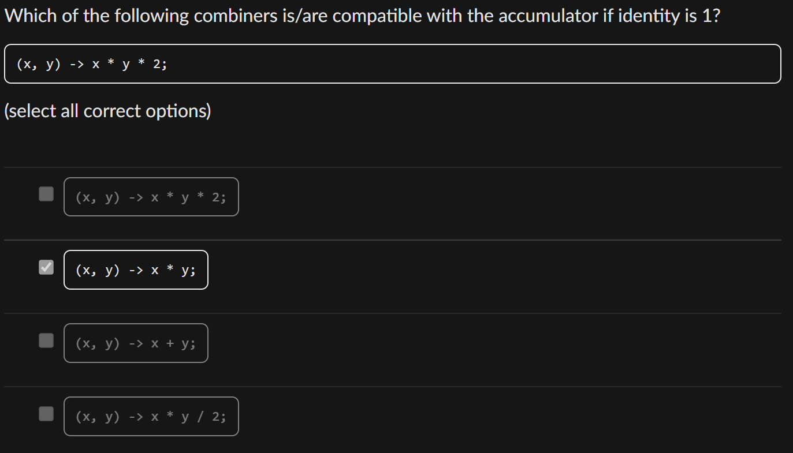

# Diagnostic Quiz

## Problems

### \*1-7. Application of Monad Laws

> **Trace through the program step by step** to see if the certain class/type logic follows the three Monad Laws anot.

Question 1-6 are actually proving that this type A follows the three **monad laws**. Among these questions, I think those related to the **associative law** are worth trying again!


```java
class A {
  private final int value;
  private final int cumulative;

  public A(int value, int cumulative) {
    this.value = value;
    this.cumulative = cumulative;
  }

  public static A of(int value) {
    return new A(value, 0);
  }

  public A flatMap(Transformer<Integer, A> transformer) {
    A updated = transformer.transform(this.value);
    return new A(updated.value, updated.cumulative + this.cumulative);
  }

  public String toString() {
    return this.value + " " + this.cumulative;
  }
}
```


#### \*5. What does the following code evaluate to?


```java
A.of(1)
    .flatMap(x -> incrA(x).flatMap(y -> sqrA(y)))
    .toString()
```


By tracing through the program step by step, we can start from **left to right**, and then **combine the result** from **right to left**. The answer should be `4 3`.

### 8. Parallel and Concurrent Programming

> Having multiple cores/processors is a prerequisite to running a program in parallel.

### 9. Requirements for a stream to be parallelized

> The **stream operations** pipeline **should not** have:
>
> 1. an operation with a **side effect**
> 2. an operation that **interferes with the data source**.
> 3. an operation that is **stateful**

### \*14. More on `reduce()`

> Include the three rules for `reduce()`  to be parallelizable into cheatsheet!

<figure><figcaption></figcaption></figure>

This questions explicitly asks for **the compatibility rule**, so we want to test

```java
combiner.apply(u, accumulator.apply(identity, t))
== accumulator.apply(u, t)
```



Starting from L.H.S, `accumulator.apply(identity, t) = 2 * t`, then `combiner.apply(u, 2 * t) = u * 2 * t * 2 = u * t * 4`.

R.H.S `accumulator.apply(u, t) = u * t * 2`.

Since L.H.S $$\neq$$ R.H.S, it **fails** the **compatibility rule**.



Starting from L.H.S, `accumulator.apply(identity, t) = 2 * t`, then `combiner.apply(u, 2 * t) = u * 2 * t = u * t * 2`.

R.H.S `accumulator.apply(u, t) = u * t * 2`.

Since L.H.S $$=$$ R.H.S, it **passes** the **compatibility rule**.



Starting from L.H.S, `accumulator.apply(identity, t) = 2 * t`, then `combiner.apply(u, 2 * t) = u * 2 * t = u + t * 2`.

R.H.S `accumulator.apply(u, t) = u * t * 2`.

Since L.H.S $$\neq$$ R.H.S, it **fails** the **compatibility rule**.



Starting from L.H.S, `accumulator.apply(identity, t) = 2 * t`, then `combiner.apply(u, 2 * t) = u * 2 * t = u * t * 2 / 2 = u * t`.

R.H.S `accumulator.apply(u, t) = u * t * 2`.

Since L.H.S $$\neq$$ R.H.S, it **fails** the **compatibility rule**.



### 15. Requirements for `reduce()` to be safe to be parallelized

> For a `reduce(identity, accumulator, combiner)` operation to be **safe and correct** for **parallel execution**, it must follow these **three rules:**
>
> 1. Identity Rule
> 2. Associativy Rule
> 3. Compatibility Rule

## Tips

1. **Trace through the program step by step** to see if the certain class/type logic follows the three Monad Laws anot.
2. Having multiple cores/processors is a prerequisite to running a program in **parallel**.
3. The **stream operations** pipeline **should not** have:
   1. an operation with a **side effect**
   2. an operation that **interferes with the data source**.
   3. an operation that is **stateful**
4. Include the three rules for `reduce()`  to be parallelizable into cheatsheet!
5. For a `reduce(identity, accumulator, combiner)` operation to be **safe and correct** for **parallel execution**, it must follow these **three rules:**
   1. Identity Rule
   2. Associativy Rule
   3. Compatibility Rule
