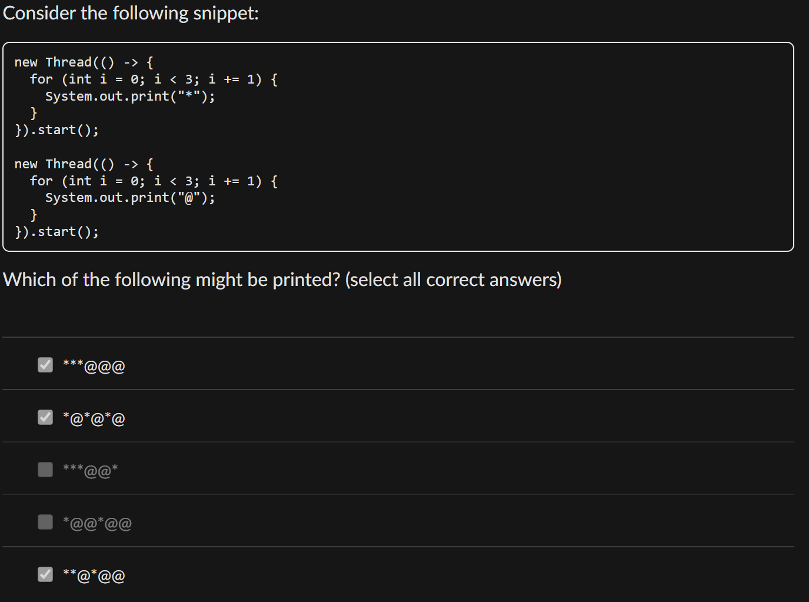
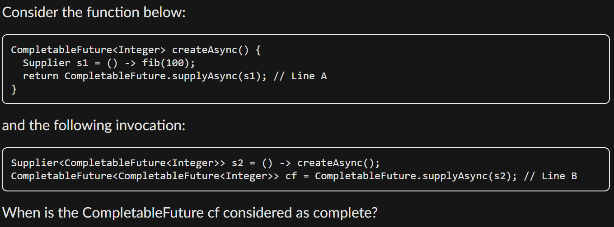
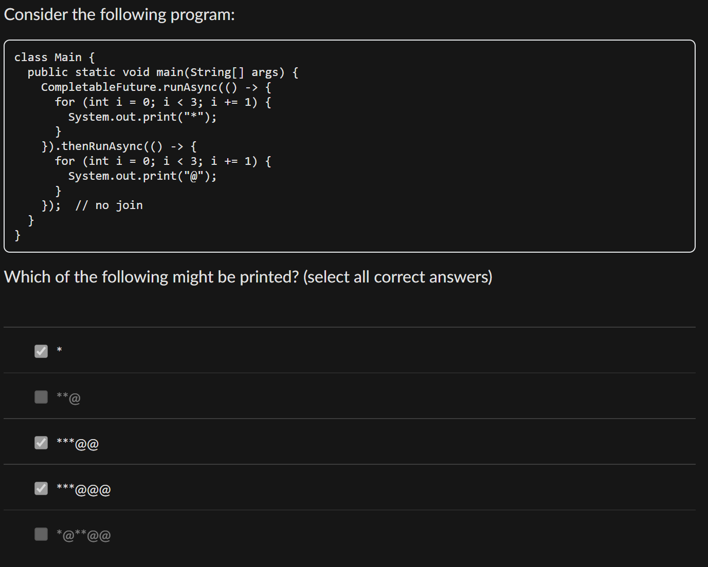
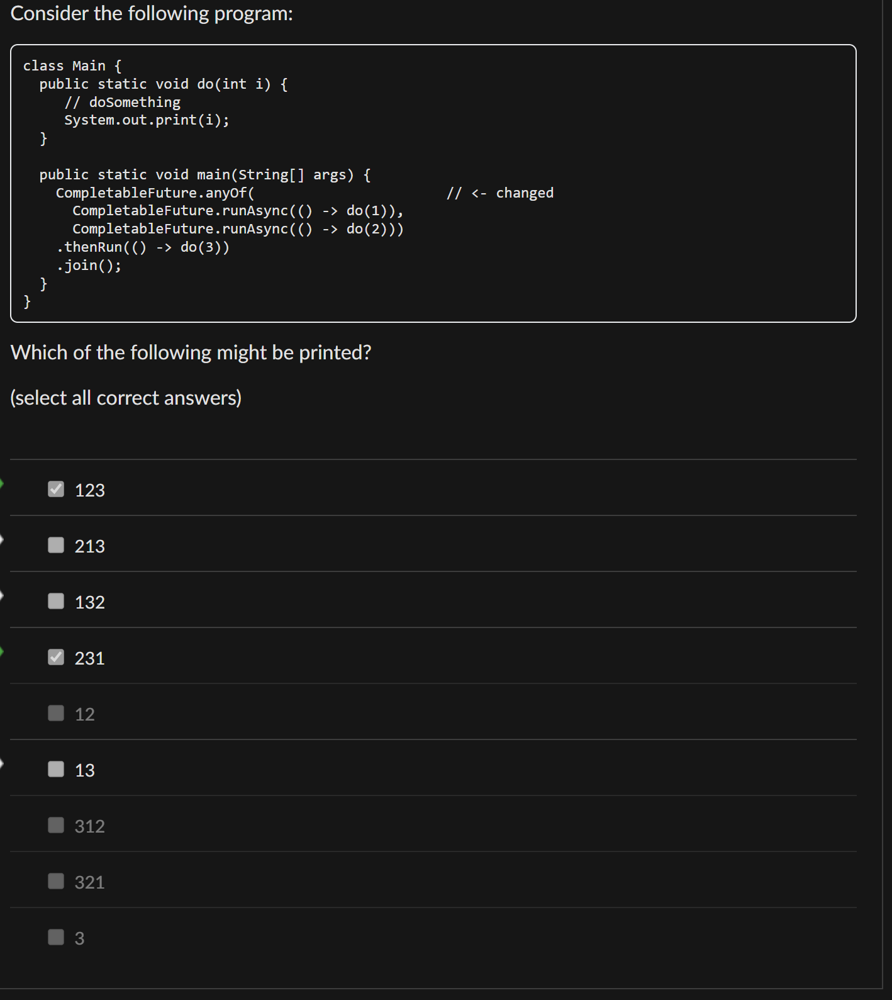

# Diagnostic Quiz

## Problems

### 1. Tricky "Thread Execution" Sequence

> `System.out.println` is a synchronous method call!

So, the following code will guarantee that `hello` is printed before `world`.


```java
System.out.println("hello");
new Thread(() -> { System.out.println("world"); }).start();
```



So, actually this problem isn't about the **thread execution sequence,** we cannot know the **execution sequence** for threads!


### 2. Possible Thread Execution Sequence

> In Thread programming, there is **no sequence** of which thread will be executed first. So, be always careful, there may be lots of possibilities!

<figure><figcaption></figcaption></figure>

For this question, actually, we are **not guaranteed** that `*` will be printed first, it's just because we need to choose all the possible output from these five options (these five options are **not exhaustive**)!

### \*3-5. When is `CompletableFuture<T>` complete?

> 1. If it is a `CompletableFuture<T>`, let's say `CompleteableFuture<...> cf;`
>    1. If `cf = CompletableFuture.supplyAsync(s)`, then after the method call `s.get()`, `cf` is **complete**
>    2. If `cf = CompletableFuture.runAsync(r)` is a **Runnable**, then after the method call `r.run()`, `cf` is **complete**
>    3. This applies no matter how many nested CompletableFuture are in `s` or `r`, as long as finally `s` and `r` are **Supplier** or **Runnable**.
> 2. If it is a `CompletedFuture`, let's say `CompleteableFuture<...> cf = CompletableFuture.completedFuture(f)`, where `f` is a normal method. `cf` is **complete** immediately after the creating statement `CompletableFuture::completedFuture`.

<figure><figcaption></figcaption></figure>

According to our rule of thumb, `cf` is complete only after the method call of `s2.get()`.


The method call `s2.get()` is **not explicitly** called in the called. Instead, it is **implicitly called** in somewhere else.


### \*8. Possible output with no `join()`

> If **no** `.join()` or `.get()` is called after the CompletableFuture, your output may have some **possibilities**, a.k.a **non-determinstic output**.

<figure><figcaption></figcaption></figure>

Since **no** `.join()` or `.get()` is called, we have three possible correct options!

### \*10. Possible output with `anyOf()`

> Possible output with `anyOf()` is a bit **tricky**, fully utilize your exhausitive thinking.

<figure><figcaption></figcaption></figure>

In this question, the printing of 1 and 2 are actually very flexible, as long as there is at least one 1 or 2 in front of 3, that will be enough. So, exhaustively, there will be 6 possibilities, `123, 213, 132, 231, 13, 23`.

### 11-15. ForkJoinPool

> 1. `task.compute()` is just a **normal method call**, this **target task** won't be added to the current worker's task dequeue.
> 2. Use the rule of thumb from [Lec 11](./#behind-the-scene-of-pool.invoke-task)! Include into cheatsheet.
> 3. When dealing with **work stealing** problem, always write down the **content** of the worker to-be-stolen's **task dequeue**, and its **task at the tail** will be stolen!


```java
class Task extends RecursiveTask<Integer> {
  private int x;
  
  Task(int x) {
    this.x = x;
  }
  
  @Override
  protected Integer compute() {
    if (x >= 4) {
      return x;
    }
    Task t1 = new Task(2 * x);
    Task t2 = new Task(2 * x + 1);
    t1.fork();
    t2.fork();
    return t2.join() + t1.join();
  }
}
```


When we call `new Task(1).compute()`, it creates two subtasks, denoted as Task(2) and Task(3). Task(2) creates two more subtasks Task(4) and Task(5); while Task(3) creates two more subtasks Task(6) and Task(7).

#### 11. One worker dequeue analysis

Suppose there is only one worker thread and it runs


```java
new Task(1).compute()
```


After Task(3) is forked, what is the content of the deque for this worker thread? (The content is listed from head to tail, with the head first and the tail last).

***

**Solution**:&#x20;

1. `new Task(1).compute()` is just a normal method call, so Task(1) won't be added to the worker's dequeue.
2. Inside `Task(1).compute()`, Task(2) is **forked** first, thus, it is added to the **head** of the worker's dequeue first. Then similar for Task (3)
3. Thus, at the end of the day, the dequeue contains `[3 2]`.

#### 12. Adding `join()` call to the analysis

After the `join` for Task(3) is invoked, what is the content of the deque for this worker thread?  (The content is listed from head to tail, with the head first and the tail last).

***

**Solution**: Use the rule of thumb from [lec](./#behind-the-scene-of-pool.invoke-task), there is only **one** worker here. So, when `.join()` of Task(3) is invoked, it belongs to the first case, and Task(3) will **pop out first** and its `compute()` method will be called. Then, use the similar analysis from [#id-11.-one-worker-dequeue-analysis](diagnostic-quiz.md#id-11.-one-worker-dequeue-analysis "mention"), we have our dequeue to be `[7 6 2]`.

#### 13. Continue from 12

After the `join` for Task(2) is invoked, what is the content of the deque for this worker thread?  (The content is listed from head to tail, with the head first and the tail last).

***

Now, Task(3) is finished, so our dequeue only contains Task(2). And then, use the similar analysis from [#id-12.-adding-join-call-to-the-analysis](diagnostic-quiz.md#id-12.-adding-join-call-to-the-analysis "mention"), we have our dequeue to be `[5 4]`.

#### 14. Work Stealing

Suppose that there is a second worker thread who tries to steal from the first worker thread, while it is running Task(3). Which task would it steal?

***

**Solution**:

1. Find the content of the dequeue while running Task(3): It should be `[7 6 2]`
2. Use rule of thumb on **work stealing**: Task(2) will be stolen.

## Tips

1. `System.out.println` is a synchronous method call!
2. In Thread programming, there is **no sequence** of which thread will be executed first. So, be always careful, there may be lots of possibilities!
3. Rule of Thumb to detect **when** a completable future is **complete**
   1. If it is a `CompletableFuture<T>`, let's say `CompleteableFuture<...> cf;`
      1. If `cf = CompletableFuture.supplyAsync(s)`, then after the method call `s.get()`, `cf` is **complete**
         1. If `cf = CompletableFuture.runAsync(r)` is a **Runnable**, then after the method call `r.run()`, `cf` is **complete**
         2. This applies no matter how many nested CompletableFuture are in `s` or `r`, as long as finally `s` and `r` are **Supplier** or **Runnable**.
   2. If it is a `CompletedFuture`, let's say `CompleteableFuture<...> cf = CompletableFuture.completedFuture(f)`, where `f` is a normal method. `cf` is **complete** immediately after the creating statement `CompletableFuture::completedFuture`.
4. If **no** `.join()` or `.get()` is called after the CompletableFuture, your output may have some **possibilities**, a.k.a **non-determinstic output**.
5. Possible output with `anyOf()` is a bit **tricky**, fully utilize your exhausitive thinking.
6. `task.compute()` is just a **normal method call**, this **target task** won't be added to the current worker's task dequeue.
7. Use the rule of thumb from [Lec 11](./#behind-the-scene-of-pool.invoke-task)! Include into cheatsheet.
8. When dealing with **work stealing** problem, always write down the **content** of the worker to-be-stolen's **task dequeue**, and its **task at the tail** will be stolen!
