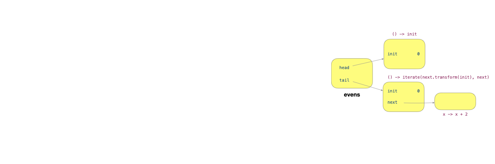

# Lecture 09 - InfiniteList and Stream

## Eager List vs. Infinite List

* **EagerList**: Stores actual values directly in fields (`T head, EagerList<T> tail`)
* **InfiniteList**: Stores producers of values (`Producer<T> head, Producer<InfiniteList<T>> tail`)


Always use this recursive thinking — A list is made up of its **head element** and the **rest** ("tail") when dealing with Eager List and Infinite List.


### Method Implementations

#### `head()`



```java
public T head() {
  return this.head;
}
```



```java
public T head() {
  T h = this.head.produce();
  // Recursive call until head is not null
  return h == null ? this.tail.produce().head() : h;
}
```



**Difference**: EagerList directly returns the stored value, while InfiniteList produces the value on demand and handles null by recursively checking the tail.

#### `tail()`

#### `tail()`

**Purpose**: Returns the list without its first element.



```javascript
public EagerList<T> tail() {
  return this.tail;
}
```



```java
public InfiniteList<T> tail() {
  T h = this.head.produce();
  // Recursive call until tail is not null
  return h == null ? this.tail.produce().tail() : this.tail.produce();
}
```



**Difference**: EagerList directly returns the stored tail list, while InfiniteList produces the tail only when needed and handles null values.

#### `get(int n)`

**Purpose**: Retrieves the element at position `n` in the list.



```javascript
public T get(int n) {
  if (n == 0) {
    return this.head();
  }
  return this.tail().get(n - 1);
}
```



```java
public T get(int n) {
  if (n == 0) {
    return this.head();          // be careful!
  }                              //   use the methods
  return this.tail().get(n - 1); //   instead of fields
}
```



**Difference**: Both implementations use the same recursive approach, but InfiniteList's implementation inherently evaluates lazily due to its structure.

#### generate()

**Purpose**: Creates a list with **repeated** values.



```java
// generate(1, 4) -> 1 1 1 1
// generate(4, 1) -> 4
public static <T> EagerList<T> generate(T t, int size) {
  if (size == 0) {
    return empty();
  }
  return new EagerList<>(t, generate(t, size - 1));
}
```



```java
// generate(() -> 1) gives us 1 1 1 1 1 ...
public static <T> InfiniteList<T> generate(Producer<T> t) {
  return new InfiniteList<>(t, () -> generate(t));
}
```



**Difference**: EagerList creates a fixed-size list with a repeated value, while InfiniteList creates a potentially infinite list using a producer function (so there is no need for `size` parameter)

#### iterate()

**Purpose**: Creates a sequence by **repeatedly applying a transformation**.




```java
  // iterate(1, x -> x <= 10, x -> x + 1) gives us 1 2 3 4 5 6 7 8 9 10
  public static <T> EagerList<T> iterate(
      T init, BooleanCondition<? super T> cond, Transformer<? super T, ? extends T> op) {
    if (!cond.test(init)) {
      return empty();
    }
    return new EagerList<>(init, iterate(op.transform(init), cond, op));
  }
```





```java
// iterate(1, x -> x + 2) gives us 1 3 5 7
public static <T> InfiniteList<T> iterate(T init, Transformer<T, T> next) {
  return new InfiniteList<>(() -> init, () -> iterate(next.transform(init), next));
}
```




**Difference**: EagerList requires a condition to terminate the iteration, while InfiniteList can continue indefinitely, creating a potentially infinite sequence.

#### map()

**Purpose**: Transforms each element in the list using a provided function.



```java
// (1 2 3 4).map(x -> x * x) gives us (1, 4, 9, 16)
public <R> EagerList<R> map(Transformer<? super T, ? extends R> mapper) {
  return new EagerList<>(mapper.transform(this.head()), this.tail.map(mapper));
}
```



```java
// (1 1 1 1 ...).map(x -> x * 2) gives us (2 2 2 2 ...)
public <R> InfiniteList<R> map(Transformer<? super T, ? extends R> mapper) {
  return new InfiniteList<>(() -> mapper.transform(this.head()),
      () -> this.tail().map(mapper));
}
```



**Difference**: EagerList immediately applies the transformation to each element, while InfiniteList creates a new list with transformation functions that will execute only when the values are needed.

#### filter()

**Purpose**: Creates a new list containing only elements that satisfy a condition.



```java
// (1 2 3 4).filter(x -> x % 2 == 0) gives us (2, 4)
public EagerList<T> filter(BooleanCondition<? super T> cond) {
  if (cond.test(this.head())) {
    return new EagerList<>(this.head(), this.tail().filter(cond));
  }
  return this.tail.filter(cond);
}
```



```java
public InfiniteList<T> filter(BooleanCondition<? super T> cond) {
  Producer<T> newHead = () -> (cond.test(this.head()) ? this.head() : null);
  return new InfiniteList<>(newHead, () -> this.tail().filter(cond));
}
```



**Difference**: EagerList immediately evaluates conditions and creates a new list with only matching elements. InfiniteList creates a producer that will check the condition only when the element is accessed, returning `null` for elements that don't match.

### Tips

In summary, here are some tips

1. A lambda can only be passed to a method if the method's parameter is a [functional-interface.md](lec-08-functional-programming/functional-interface.md "mention")
2. The lambda passed in defines how the functional interface works!
3. For the InifiniteList, the element will only be evaluated when we call either `get()` (indirectly calling `head()`) or `head()` directly.

<details>

<summary>Revisit Lazy Evaluation</summary>

Lazy evaluation means we can delay a computation using the [`Producer`](lec-08-functional-programming/functional-interface.md#producer-less-than-t-greater-than-produce) functional interface. So, instead of doing `compute()` which is immediately evaluated when executed, we replace it with a `Producer` `() -> compute()`, which "stores" the computation in an instance of `Producer`, and we only call it when we invoke the `produce` method. (In Infinite List, invoking the `produce` method is done by calling `head()` directly or indirectly).

</details>

### Under the Hood

For the Infinite List, what on earth happen if we try to invoke the following code, where `evens` is an Infinite List with `0, 2, 4, 6, 8, ...`.

```java
evens.map(x -> x + 1).map(x -> x * 2).head(); // 2
```

First, let's rewrite this statement by adding some intermediate variables

```java
InfiniteList<Integer> evens = InfiniteList.iterate(0, x -> x + 2); // 0, 2, 4, 6, ...
InfiniteList<Integer> odds = evens.map(x -> x + 1); // 1, 3, 5, ...
InfiniteList<Integer> altEvens = odds.map(x -> x * 2); // 2, 6, 10, .. 
altEvens.head();
```

First, when we create an evens,

```java
InfiniteList<Integer> evens = InfiniteList.iterate(0, x -> x + 2); // 0, 2, 4, 6, ...
```

The heap should look as follow,

<figure><figcaption></figcaption></figure>

`evens` is an object which has two fields, `head` and `tail`, and each points to an instance of the `Producer` functional interface (a.k.a, a lambda expression shown in the figure). As we have seen [before](lec-08-functional-programming/#anonymous-class-writing),

> a **lambda expression** is essentially **syntactic sugar** for writing an **anonymous class** that implements a functional interface.

so, here inside these two lambdas, it will follow the exact rules of [variable capture](lec-07-immutability-and-nested-classes/#variable-capture), which are

> the **local class** (including the anonymous class) will capture the following variables
>
> 1. The **local variables** of the method where the local class comes from (including the arguments, see more in [Diagnostic Quiz Q13](https://wenbo-notes.gitbook.io/cs2030s-notes/lec-rec-lab-exes/lecture/lec-07-immutability-and-nested-classes/diagnostic-quiz#id-13.-variable-capture))
> 2. The **instance** that invokes the method where the local class comes from. (See more in [Rec 05](https://wenbo-notes.gitbook.io/cs2030s-notes/lec-rec-lab-exes/recitation/rec-05#id-01.-stack-and-heap-with-nested-class))

So, the two lambdas capture the variable `init`. The `tail` additionally captures the variable `next`, which itself is an instance of `Transformer<T, T>`.

***

Simiarly, you will get the final graph shown like below

<figure><figcaption></figcaption></figure>

For more information, please see from the [lecture notes](https://nus-cs2030s.github.io/2425-s2/33-infinitelist.html#under-the-hood).
