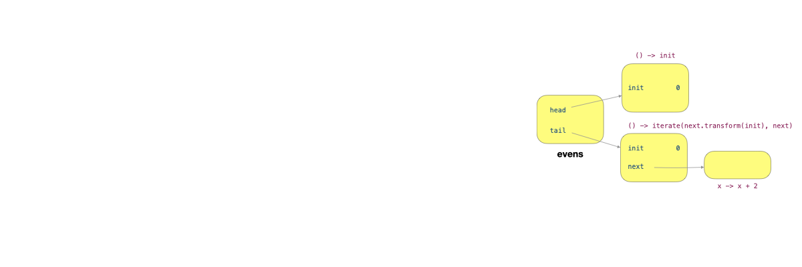
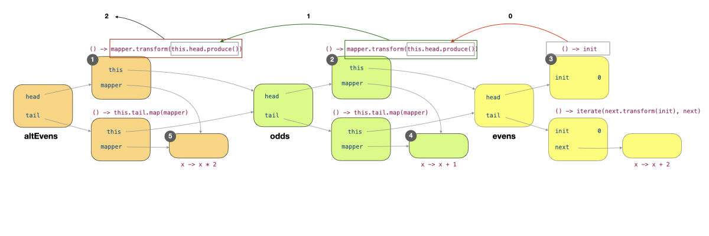

# Lecture 09 - InfiniteList and Stream

## Eager List vs. Infinite List

* **EagerList**: Stores actual values directly in fields (`T head, EagerList<T> tail`)
* **InfiniteList**: Stores producers of values (`Producer<T> head, Producer<InfiniteList<T>> tail`)


Always use this recursive thinking — A list is made up of its **head element** and the **rest** ("tail") when dealing with Eager List and Infinite List.


### Method Implementations



`head()`



```java
public T head() {
  return this.head;
}
```



```java
public T head() {
  T h = this.head.produce();
  // Recursive call until head is not null
  return h == null ? this.tail.produce().head() : h;
}
```



**Difference**: EagerList directly returns the stored value, while InfiniteList produces the value on demand and handles null by recursively checking the tail.



`tail()`

**Purpose**: Returns the list without its first element.



```javascript
public EagerList<T> tail() {
  return this.tail;
}
```



```java
public InfiniteList<T> tail() {
  T h = this.head.produce();
  // Recursive call until tail is not null
  return h == null ? this.tail.produce().tail() : this.tail.produce();
}
```



**Difference**: EagerList directly returns the stored tail list, while InfiniteList produces the tail only when needed and handles null values.



`get(int n)`

**Purpose**: Retrieves the element at position `n` in the list.



```javascript
public T get(int n) {
  if (n == 0) {
    return this.head();
  }
  return this.tail().get(n - 1);
}
```



```java
public T get(int n) {
  if (n == 0) {
    return this.head();          // be careful!
  }                              //   use the methods
  return this.tail().get(n - 1); //   instead of fields
}
```



**Difference**: Both implementations use the same recursive approach, but InfiniteList's implementation inherently evaluates lazily due to its structure.



`generate()`

**Purpose**: Creates a list with **repeated** values.



```java
// generate(1, 4) -> 1 1 1 1
// generate(4, 1) -> 4
public static <T> EagerList<T> generate(T t, int size) {
  if (size == 0) {
    return empty();
  }
  return new EagerList<>(t, generate(t, size - 1));
}
```



```java
// generate(() -> 1) gives us 1 1 1 1 1 ...
public static <T> InfiniteList<T> generate(Producer<T> t) {
  return new InfiniteList<>(t, () -> generate(t));
}
```



**Difference**: EagerList creates a fixed-size list with a repeated value, while InfiniteList creates a potentially infinite list using a producer function (so there is no need for `size` parameter)



`iterate()`

**Purpose**: Creates a sequence by **repeatedly applying a transformation**.




```java
  // iterate(1, x -> x <= 10, x -> x + 1) gives us 1 2 3 4 5 6 7 8 9 10
  public static <T> EagerList<T> iterate(
      T init, BooleanCondition<? super T> cond, Transformer<? super T, ? extends T> op) {
    if (!cond.test(init)) {
      return empty();
    }
    return new EagerList<>(init, iterate(op.transform(init), cond, op));
  }
```





```java
// iterate(1, x -> x + 2) gives us 1 3 5 7
public static <T> InfiniteList<T> iterate(T init, Transformer<T, T> next) {
  return new InfiniteList<>(() -> init, () -> iterate(next.transform(init), next));
}
```




**Difference**: EagerList requires a condition to terminate the iteration, while InfiniteList can continue indefinitely, creating a potentially infinite sequence.



`map()`

**Purpose**: Transforms each element in the list using a provided function.




```java
// (1 2 3 4).map(x -> x * x) gives us (1, 4, 9, 16)
public <R> EagerList<R> map(Transformer<? super T, ? extends R> mapper) {
  return new EagerList<>(mapper.transform(this.head()), this.tail.map(mapper));
}
```





```java
// (1 1 1 1 ...).map(x -> x * 2) gives us (2 2 2 2 ...)
public <R> InfiniteList<R> map(Transformer<? super T, ? extends R> mapper) {
  return new InfiniteList<>(() -> mapper.transform(this.head()),
      () -> this.tail().map(mapper));
}
```




**Difference**: EagerList immediately applies the transformation to each element, while InfiniteList creates a new list with transformation functions that will execute only when the values are needed.



`filter()`

**Purpose**: Creates a new list containing only elements that satisfy a condition.



```java
// (1 2 3 4).filter(x -> x % 2 == 0) gives us (2, 4)
public EagerList<T> filter(BooleanCondition<? super T> cond) {
  if (cond.test(this.head())) {
    return new EagerList<>(this.head(), this.tail().filter(cond));
  }
  return this.tail.filter(cond);
}
```



```java
public InfiniteList<T> filter(BooleanCondition<? super T> cond) {
  Producer<T> newHead = () -> (cond.test(this.head()) ? this.head() : null);
  return new InfiniteList<>(newHead, () -> this.tail().filter(cond));
}
```



**Difference**: EagerList immediately evaluates conditions and creates a new list with only matching elements. InfiniteList creates a producer that will check the condition only when the element is accessed, returning `null` for elements that don't match.



### Tips

In summary, here are some tips

1. A lambda can only be passed to a method if the method's parameter is a [functional-interface.md](../lec-08-functional-programming/functional-interface.md "mention")
2. The lambda passed in defines how the functional interface works!
3. For the InifiniteList, the element will only be evaluated when we call either `get()` (indirectly calling `head()`) or `head()` directly.

<details>

<summary>Revisit Lazy Evaluation</summary>

Lazy evaluation means we can delay a computation using the [`Producer`](../lec-08-functional-programming/functional-interface.md#producer-less-than-t-greater-than-produce) functional interface. So, instead of doing `compute()` which is immediately evaluated when executed, we replace it with a `Producer` `() -> compute()`, which "stores" the computation in an instance of `Producer`, and we only call it when we invoke the `produce` method. (In Infinite List, invoking the `produce` method is done by calling `head()` directly or indirectly).

</details>

### Under the Hood

For the Infinite List, what on earth happen if we try to invoke the following code, where `evens` is an Infinite List with `0, 2, 4, 6, 8, ...`.

```java
evens.map(x -> x + 1).map(x -> x * 2).head(); // 2
```

First, let's rewrite this statement by adding some intermediate variables

```java
InfiniteList<Integer> evens = InfiniteList.iterate(0, x -> x + 2); // 0, 2, 4, 6, ...
InfiniteList<Integer> odds = evens.map(x -> x + 1); // 1, 3, 5, ...
InfiniteList<Integer> altEvens = odds.map(x -> x * 2); // 2, 6, 10, .. 
altEvens.head();
```

First, when we create an evens,

```java
InfiniteList<Integer> evens = InfiniteList.iterate(0, x -> x + 2); // 0, 2, 4, 6, ...
```

The heap should look as follow,

<figure><figcaption></figcaption></figure>

`evens` is an object which has two fields, `head` and `tail`, and each points to an instance of the `Producer` functional interface (a.k.a, a lambda expression shown in the figure). As we have seen [before](../lec-08-functional-programming/#anonymous-class-writing),

> a **lambda expression** is essentially **syntactic sugar** for writing an **anonymous class** that implements a functional interface.

so, here inside these two lambdas, it will follow the exact rules of [variable capture](../lec-07-immutability-and-nested-classes/#variable-capture), which are

> the **local class** (including the anonymous class) will capture the following variables
>
> 1. The **local variables** of the method where the local class comes from (including the arguments, see more in [Diagnostic Quiz Q13](https://wenbo-notes.gitbook.io/cs2030s-notes/lec-rec-lab-exes/lecture/lec-07-immutability-and-nested-classes/diagnostic-quiz#id-13.-variable-capture))
> 2. The **instance** that invokes the method where the local class comes from. (See more in [Rec 05](https://wenbo-notes.gitbook.io/cs2030s-notes/lec-rec-lab-exes/recitation/rec-05#id-01.-stack-and-heap-with-nested-class))

So, the two lambdas capture the variable `init`. The `tail` additionally captures the variable `next`, which itself is an instance of `Transformer<T, T>`.

***

Simiarly, you will get the final graph shown like below

<figure><figcaption></figcaption></figure>

For more information, please see from the [lecture notes](https://nus-cs2030s.github.io/2425-s2/33-infinitelist.html#under-the-hood).

## Streams

Our Infinite List has its counterpart in the Java implementation, which is called `Stream`, but with more functionalities.

### Building a Stream

We can build a stream by using



`of`

We can use the **static factory** method `of` (e.g., `Stream.of(1, 2, 3)`).

**Method Declaration**

`t` is the element of the Stream.

```java
static <T> Stream<T> of(T t)
```

**Example**


```java
// 1. Using static factory method Stream.of()
Stream<Integer> streamOf = Stream.of(1, 2, 3, 4, 5);
streamOf.forEach(System.out::println);
// Expected output:
// 1
// 2
// 3
// 4
// 5
```




`generate()` and `iterate()`

We can use the `generate` and `iterate` methods (similar to our `InfiniteList`)

**Method Declaration**



`Supplier` is the same as `Producer` in CS2030S.

```java
static <T> Stream<T> generate(Supplier<? extends T> s)
```



`seed` is the initial element, `hasNext` is an optional ending condition, which is a `Predicate` which is equivalent to `BooleanCondition` in CS2030S. `next` is a `UnaryOperator<T>` which is equivalent to `Transformer<T, T>` in CS2030S.

```java
static <T> Stream<T> iterate(T seed,
 Predicate<? super T> hasNext,
 UnaryOperator<T> next)

// or
static <T> Stream<T> iterate(T seed,
 UnaryOperator<T> f)
```



**Example**




```java
// 2. Using Stream.generate() - creates an infinite stream
Stream<Integer> streamGenerate = Stream.generate(() -> 7).limit(5);
streamGenerate.forEach(i -> System.out.print(i + " "));
// Expected output: 7 7 7 7 7
```





```java
// 3. Using Stream.iterate() - creates an infinite stream with defined progression
Stream<Integer> streamIterate = Stream.iterate(1, n -> n + 2).limit(5);
streamIterate.forEach(System.out::println);
// Expected output:
// 1
// 3
// 5
// 7
// 9
```






`Arrays::stream`

We can convert an array into a `Stream` using `Arrays::stream`

```java
// 4. Converting an array to a Stream using Arrays.stream()
Integer[] array = {6, 7, 8, 9, 10};
Stream<Integer> streamFromArray = Arrays.stream(array);
streamFromArray.forEach(System.out::println);
// Expected output:
// 6
// 7
// 8
// 9
// 10
```



`List::stream`

We can convert a `List` instance (or any `Collection` instance) into a `Stream` using `List::stream`

```java
// 5. Converting a Collection (List) to a Stream using List.stream()
List<String> list = List.of("apple", "banana", "cherry", "date");
Stream<String> streamFromList = list.stream();
streamFromList.forEach(System.out::println);
// Expected output:
// apple
// banana
// cherry
// date
```



### Terminal Operations

A terminal operation is an operation on the stream that triggers the **evaluation** of the stream. A typical way of writing code that operates on streams is to **chain a series of intermediate operations together**, ending with a **terminal operation**.



`forEach`

The `forEach` method is a terminal operation that takes in a stream and applies a lambda expression to each element.

The lambda expression to apply does not return any value. Java provides the [`Consumer<T>`](https://docs.oracle.com/en/java/javase/21/docs/api/java.base/java/util/function/Consumer.html) functional interface for this. We have already seen pretty much examples from [#building-a-stream](./#building-a-stream "mention").

**Method Declaration**

`action` is a `Consumer`, which is equivalent to `Consumer` in CS2030S.

```java
void forEach(Consumer<? super T> action)
```

**Example**

```java
// Example of forEach terminal operation in Stream
List<Integer> numbers = List.of(1, 2, 3, 4, 5);
System.out.print("Processing each element: ");
numbers.stream()
       .forEach(num -> System.out.print(num + " "));
// Expected output: Processing each element: 1 2 3 4 5
```



`count()`

The `count()` method in Java Streams is a terminal operation that returns the number of elements in the stream.

```java
long count = Stream.of("apple", "banana", "cherry").count();
System.out.println(count); // Output: 3
```


`count` processes the entire stream, so calling it on an **infinite stream** will cause an infinite loop.




`reduce()`

The `reduce` operation applies a binary function (or a.k.a, a `Combiner` in CS2030S) to each element in the stream to reduce them to a single result.

**Method Declaration**

The `BinaryOperator` is equivalent to `Combiner` in CS2030S.

```java
T reduce(T identity, BinaryOperator<T> accumulator)
```

**Example**

```java
// reduce example
List<Integer> numbers = List.of(1, 2, 3, 4, 5);
int sum = numbers.stream()
                .reduce(0, (a, b) -> a + b);
System.out.println("Sum: " + sum);
// Expected output: Sum: 15
```

Here, `0` is called the **identity value**, `(a,b) -> a + b` is called an **accumulation function**. This process is equivalent to the following pseudocode:

```
result = identity
for each element in the stream
     result = accumulator.apply(result, element)
return result
```



`noneMatch()`

The `noneMatch` operation returns true if **no** elements in the stream match the given predicate, short-circuiting (stopping early) if any **matching** element is found.

**Method Declaration**

`Predicate` is equivalent to `BooleanCondition` in CS2030S.

```java
boolean noneMatch(Predicate<? super T> predicate)
```

**Example**

```java
// noneMatch example
List<Integer> numbers = List.of(1, 3, 5, 7, 9);
boolean hasNoEvens = numbers.stream()
                           .noneMatch(n -> n % 2 == 0);
System.out.println("No even numbers: " + hasNoEvens);
// Expected output: No even numbers: true
```



`allMatch()`

The `allMatch` operation returns true if **all** elements in the stream match the given predicate, short-circuiting if any **non-matching** element is found.

**Method Declaration**

`Predicate` is equivalent to `BooleanCondition` in CS2030S.

```java
boolean allMatch(Predicate<? super T> predicate)
```

**Example**

```java
// allMatch example
List<Integer> numbers = List.of(1, 3, 5, 7, 9);
boolean allPositive = numbers.stream()
                            .allMatch(n -> n > 0);
System.out.println("All positive numbers: " + allPositive);
// Expected output: All positive numbers: true
```



`anyMatch()`

The `anyMatch` operation returns true if at least one element in the stream matches the given predicate, short-circuiting once a **matching** element is found.

**Method Declaration**

`Predicate` is equivalent to `BooleanCondition` in CS2030S.

```java
boolean anyMatch(Predicate<? super T> predicate)
```

**Example**

```java
// anyMatch example
List<Integer> numbers = List.of(1, 3, 5, 7, 9);
boolean hasDigitGreaterThan5 = numbers.stream()
                                     .anyMatch(n -> n > 5);
System.out.println("Has number greater than 5: " + hasDigitGreaterThan5);
// Expected output: Has number greater than 5: true
```



### Intermediate Stream Operations

An _intermediate_ operation on stream returns another `Stream`. Intermediate operations are **lazy** and **do not** cause the stream to be **evaluated**.



`map()`

The `map` operation transforms **each element in the stream** by **applying a function to it**, producing a **new stream of the transformed elements** with a one-to-one relationship.

**Method Declaration**

`Function` is equivalent to `Transformer<T,R>` in CS2030S.

```java
<R> Stream<R> map(Function<? super T,? extends R> mapper)
```

**Example**

```java
// map example
List<String> words = List.of("Java", "Stream", "API");
words.stream()
     .map(String::length)
     .forEach(length -> System.out.print(length + " "));
// Expected output: 4 6 3
```



`flatMap()`

The `flatMap` operation transforms **each element into a stream** and then [**flattens**](#user-content-fn-1)[^1] **all resulting streams into a single stream**, useful for working with nested collections or when one element should produce multiple output elements

**Method Declaration**

`Function` is equivalent to `Transformer<T,R>` in CS2030S.

```java
<R> Stream<R> flatMap(Function<? super T,? extends Stream<? extends R>> mapper)
```

**Example**

```java
// flatMap example
List<List<Integer>> nestedLists = List.of(
    List.of(1, 2), 
    List.of(3, 4, 5), 
    List.of(6)
);
nestedLists.stream()
           .flatMap(Collection::stream)
           .forEach(num -> System.out.print(num + " "));
// Expected output: 1 2 3 4 5 6
```

`flatMap` takes each element in the stream (each inner list) and transforms it into a new stream of its own elements. Then, it "flattens" all these streams into one single stream.


Why `Collection` not `List` here? It is because `Collection` is a broader concept that includes `List`. It’s a way to write **flexible code** that could work with other collection types (like `Set`) if needed. Here, since the inner elements are `List`s, it works perfectly.




`filter()`

The `filter` operation selects elements from the stream that satisfy a given **predicate** (boolean condition), creating a new stream that contains only the elements that passed the test.

**Method Declaration**

`Predicate` is equivalent to `BooleanCondition` in CS2030S.

```java
Stream<T> filter(Predicate<? super T> predicate)
```

**Example**

```java
// filter example
List<Integer> numbers = List.of(1, 2, 3, 4, 5, 6, 7, 8, 9, 10);
numbers.stream()
       .filter(n -> n % 2 == 0)  // Keep only even numbers
       .forEach(n -> System.out.print(n + " "));
// Expected output: 2 4 6 8 10
```



`sorted()`&#x20;

The `sorted` operation arranges elements according to natural order or a provided comparator, requiring the entire stream to be processed before producing any results.

```java
// sorted example
List<Integer> numbers = List.of(5, 3, 8, 1, 4);
numbers.stream()
       .sorted()
       .forEach(n -> System.out.print(n + " "));
// Expected output: 1 3 4 5 8
```



`distinct()`

The `distinct` operation filters out duplicate elements based on their `equals()` method, returning a stream with only unique elements.

```java
// distinct example
List<Integer> duplicates = List.of(1, 2, 2, 3, 3, 3, 4, 4, 4, 4);
duplicates.stream()
          .distinct()
          .forEach(n -> System.out.print(n + " "));
```


Both `sorted()` and `distinct()` operations are **stateful** (they maintain internal state about previously seen elements) and bounded (they need to process all elements before producing results, a.k.a, they should **only** be called on a finite stream), which impacts performance especially with large datasets.




`limit()`

The `limit` operation restricts the stream to process only a maximum number of elements, which can improve performance for large or infinite streams.

```java
// limit example
List<Integer> numbers = List.of(1, 2, 3, 4, 5, 6, 7, 8, 9, 10);
numbers.stream()
       .limit(5)
       .forEach(n -> System.out.print(n + " "));
// Expected output: 1 2 3 4 5
```



`takeWhile()`

The `takeWhile` operation (introduced in Java 9) takes elements from the stream as long as the predicate returns true, stopping at the first element that fails the condition.

**Method Declaration**

`Predicate` is equivalent to `BooleanCondition` in CS2030S.

```java
default Stream<T> takeWhile(Predicate<? super T> predicate)
```

**Example**

```java
// takeWhile example (Java 9+)
List<Integer> numbers2 = List.of(2, 4, 6, 7, 8, 10);
numbers2.stream()
        .takeWhile(n -> n % 2 == 0)
        .forEach(n -> System.out.print(n + " "));
// Expected output: 2 4 6
```


`limit()` and `takeWhile()` are intermediate opeartions that convert from infinite stream to finite stream. (Although finite, but still lazy evaluated)




`peek()`

The `peek` operation creates a "fork" in the stream pipeline, allowing us to perform side effects (like debugging) without modifying the elements flowing through the stream. It takes a `Consumer` function that can view or process each element while letting the original elements continue unchanged through the pipeline.

**Method Declaration**

`Consumer` is equivalent to `Consumer` in CS2030S.

```java
Stream<T> peek(Consumer<? super T> action)
```

**Example**

```java
// peek example
List<String> names = List.of("Alice", "Bob", "Charlie");
names.stream()
     .peek(name -> System.out.print("Processing: " + name + " -> "))
     .map(String::toUpperCase)
     .forEach(name -> System.out.println(name));
// Expected output:
// Processing: Alice -> ALICE
// Processing: Bob -> BOB
// Processing: Charlie -> CHARLIE
```



### Consumed Once

One of the greatest limitations of `Stream`, which does not apply to our `InfiniteList`, is that a stream can only be operated once.

```java
Stream<Integer> s = Stream.of(1,2,3);
s.count();
s.count(); // <- error
```

### Specialized Stream

Java provides specialized streams (`IntStream`, `LongStream`, and `DoubleStream`) to work efficiently with primitive types, these streams have the following advantages



**Avoid the boxing/unboxing overhead of wrapper classes**

```java
// IntStream example - Avoiding boxing/unboxing overhead
List<Integer> boxedInts = List.of(1, 2, 3, 4, 5);

// Using specialized methods after converting from regular stream
int sum = boxedInts.stream()
                  .mapToInt(Integer::intValue)  // Convert to IntStream
                  .sum();  // Specialized IntStream method
System.out.println("Sum: " + sum);
// Expected output: Sum: 15
```

This can be simplified to as follows:

```java
// IntStream example - Creating and using IntStream
IntStream intStream = IntStream.range(1, 6);  // 1 to 5
int sum = intStream.sum();
System.out.println("Sum: " + sum);
// Expected output: Sum: 15
```



**Offer specialized methods like `sum()` and `average()` for numerical operations**

```java
// DoubleStream example - Numeric operations
double[] values = {1.1, 2.2, 3.3, 4.4, 5.5};
DoubleStream doubleStream = Arrays.stream(values);
DoubleStream.of(1.1, 2.2, 3.3, 4.4, 5.5)
           .average()
           .ifPresent(avg -> System.out.println("Average: " + avg));
// Expected output: Average: 3.3
```



**Can be created through factory methods like `range()`, `rangeClosed()`, or by converting from regular streams using `mapToInt()`, `mapToLong()`, or `mapToDouble()`**


```java
// LongStream example - Using factory methods
LongStream longRange = LongStream.range(1L, 6L);  // Creates 1 to 5
LongStream longRangeClosed = LongStream.rangeClosed(1L, 5L);  // Creates 1 to 5 (same result)
System.out.println("Count from range: " + longRange.count());
System.out.println("Max from rangeClosed: " + longRangeClosed.max().orElse(0));
// Expected output: 
// Count from range: 5
// Max from rangeClosed: 5
```




These specialized streams maintain the same pipeline pattern as regular streams while providing better performance for numeric computations.

### Elegance of Stream

This can be vividly shown by using an example to count the first 500 primes. Initially, our code looks like,

```java
void fiveHundredPrime() {
  int count = 0;
  int i = 2;
  while (count < 500) {
    if (isPrime(i)) {
      System.out.println(i);
      count++;
    }
    i++;
  }
}
```

By using Java Streams, this can be simplified to

```java
IntStream.iterate(2, x -> x+1)
    .filter(x -> isPrime(x))
    .limit(500)
    .forEach(System.out::println);
```

[^1]: "flatten" means taking multiple streams (or collections) produced by transforming each input element and combining them into a single, unified stream. Instead of having a stream of streams (a nested structure), flatMap merges all the inner streams into one continuous sequence of elements.
