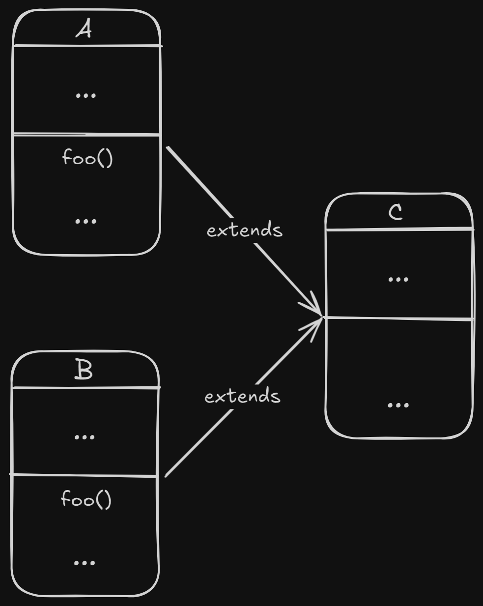
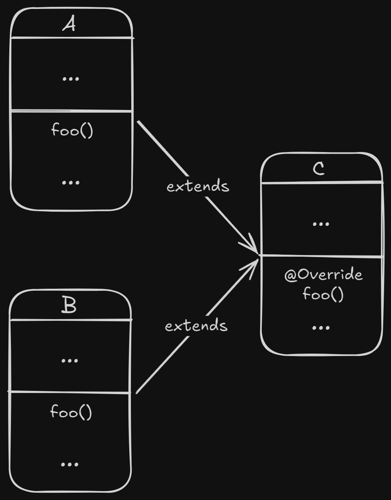

# Rec 02

## Problems

### 01. Liskov Substitution Principle and Inheritance

> When dealing with questions involve _inheritance_, always think about whether the **Liskov Substitution Principle** is violated or not. The latter can be done by seeing whether the **specifications** set by the parent class are violated or not.

In this question, firstly, we don't set any specification for our `Rectangle`. But, when we try to inherit the `Square` class from the `Rectangle` class, we explicitly specify the **specification**, which is

> the fours sides for a Square should be of the same length.

Since the parent class `Rectangle` doesn't have any specification, so there is no chance for `Square` to violate LSP. Thus till now, `Square` conform to LSP

***

Then, we make a new **specification** for our `Rectangle` class, which is

> if the most recent call to `setWidth` is `setWidth(w)` and the most recent call to `setHeight` is `setHeight(h)`, then `getArea()` must return `w*h`


Here, we didn't override the `Rectangle::setHeight` and `Rectangle::setWidth` in the `Square` class.


Now, since we add a new **specification** to the parent class, we need to verify whether LSP still holds or not. To verify that, we can easily find that it will violate the first **specification** of our `Square` class, which is the four sides of the Square should be of the same length.

***

What if we override the `Rectangle::setHeight` and `Rectangle::setWidth` in the `Square` class to set both the `height` and `width` to be the same length? Now, we may violate the second specification of our `Rectangle` class because now the `getArea` will not return `w*h`. Instead, it may return either `w*w` or `h*h`.

Thus, now we can conclude the `Square` cannot be inheritted from `Rectangle`.

***

Conversely, a `Rectangle` cannot be inheritted from a `Square` since a `Square` needs four sides to be equal, a `Rectangle` don't need this specification and thus can easily violate the LSP.

### 02. Interface and Inheritance

> A class cannot inherit from multiple classes at the same time.

Let's see the following example, where we have `A::foo` and `B::foo`. Class `C` inherits from `A` and `B`.&#x20;

<figure><figcaption></figcaption></figure>

If we do not override `foo`. What will `C::foo` call? `A::foo` or `B::foo`? We don't know. So does the compiler. Thus, we cannot inherit a class from multiple classes.

> A class can implement multiple interfaces at the same time

Suppose now `A` and `B` become two interfaces. Recall that all the methods in `interface` are `public abstract`, thus have no implementation. And all concrete classes that implement an interface must override the methods in the interface to provide a concrete implementation.

<figure><figcaption></figcaption></figure>

So, now what will happen if we call `C::foo`? By the knowledge of [#method-invocation](../lecture/lec-03-polymorphism/#method-invocation "mention"), we can clearly notice that `C::foo` will call the `foo` that is overriden in the class `C` itself. Thus, there is no problem for a class to implement several interfaces.

## Tips

1. When using LSP, think about whether the properties / specifications between these two classes are violated or not.
2. A class **cannot** inherit from multiple classes at the same time but a class **can** implement multiple interfaces at the same time.
