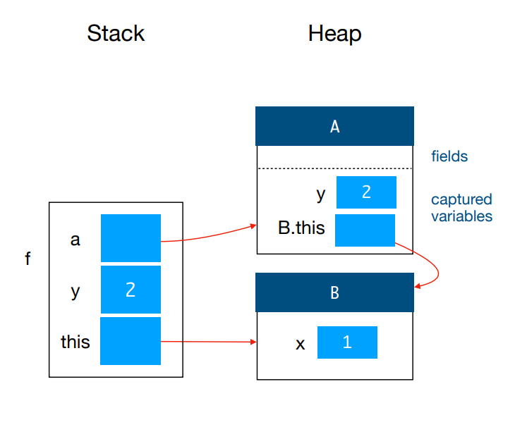

# Rec 05

## Problems

### 01. Stack and Heap with nested class

> 1. In the [#static-nested-class](../lecture/lec-07-immutability-and-nested-classes.md#static-nested-class "mention"), `this` is **as long as it is used in a non-static method.**
> 2. When accessing the **captured variables**, don't need any `this` or what.
> 3. Variable capture will also capture the **instance that invokes the method where the local class comes from**.

For example, the stack frame at Line A for the following code is as follows,


```java
class B {
    int x = 1;
    void f() {
        int y = 2;
        class A {
            void g() {
                B.this.x = y; // <--
            }
        }
        A a = new A();
        // Line A
        a.g();
    }
}
```


<figure><figcaption></figcaption></figure>

### 02. Write an immutable class

> 1. Make fields/class `final`
> 2. The class which extends from the immutable class **may not be an immutable** class.

## Tips

1. Make fields/class `final`
2. The class which extends from the immutable class **may not be an immutable** class.
