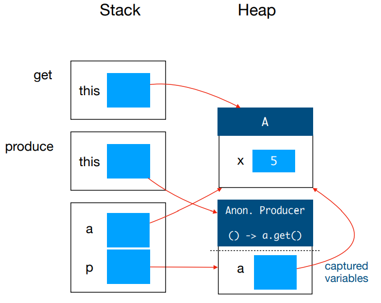

# Rec 06

Question (without answers):



Answers:



## Problems

### 01. Rewrite method into one return statement using Maybe

> The kind of question contains two steps:
>
> 1. Ignore any `null` check or equivalent (e.g. `none()` check)
> 2. Write down the actual steps that do things
> 3. Choose the corresponding methods

So, follow the three steps, after step 1 and 2, we should find our that in this question, there are three things we should do

1. get the list of languages (by calling `r.getListofLanguages()`)
2. check whether the list contains "Java"
3. If so, return the wrapper of `findInternship()` as the method's return.

Now, moving on to step 3 — choose the corresponding API from [Maybe](../exercises/exercise-5-maybe.md#main-methods-explanation).

1. `r.getListofLanguages()` will return a wrapper of "something". This tells us that we should use `flatMap()` instead of `map()`
2. "check, contains" tells us that we should use `filter()`
3. `findInternship()` will return "something", but we need to wrap it first, then return it to a function. This tells us that we should use `map()` instead of `flatMap()`.

So, the final answer will be


```java
Maybe<Internship> match(Resume r) {
    return Maybe.of(r)
        .flatMap(x -> x.getListOfLanguages())
        .filter(l -> l.contains("Java"))
        .map(l -> findInternship(l));
}
```


### 02. Stack and Heap with Lambda

> In CS2030s style,
>
> 1. The lambda expression should be **explicitly** written in the anonymous class name
> 2. The captured variable should be placed under a **dashed** line


```java
A a = new A(5);
Producer<Integer> p = () -> a.get();
p.produce();
```


So, in this question, why we have `a` as our captured variable? This is because according to the first rule from [here](https://wenbo-notes.gitbook.io/cs2030s-notes/lec-rec-lab-exes/lecture/lec-07-immutability-and-nested-classes#variable-capture):

> The **local variables** of the method where the local class comes from will be captured.

So, in this unamed method, Line 2 is acutally creating an anonymous class (local class) inside this unamed method, and `a` is a local variable in this method, so, it will be captured!

<figure><figcaption></figcaption></figure>
