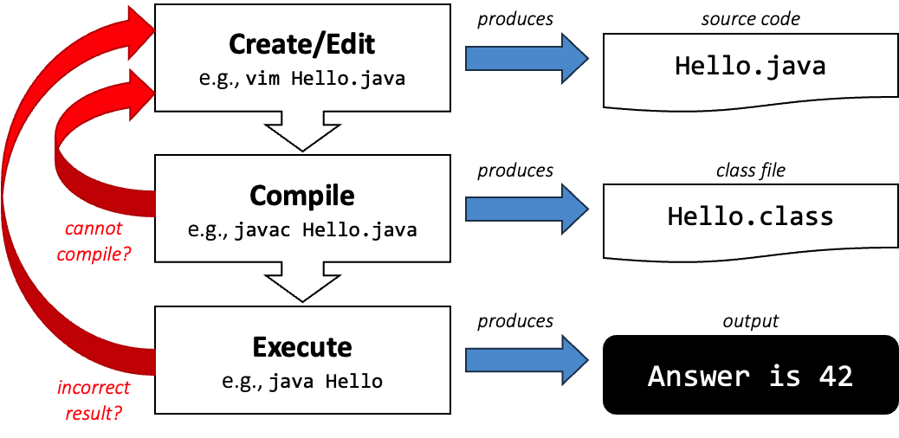
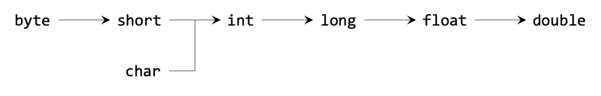

# Lec 01 - Compiler, Types, Classes, Objects

## [Program and Compiler](https://nus-cs2030s.github.io/2425-s1/01-compiler.html)

### Software Program

A software program is [a collection of data variables and instructions on how to modify these variables](#user-content-fn-1)[^1]. To dictate these instructions to the computer, programmers usually write down the instructions using a programming language.

### Compiled vs. Intepreted Programs

* Compiler: The compiler reads in the **entire program** written in a higher-level programming language and translates it into machine code. The machine code is then saved into an **executable file**, which can be executed later. e.g., C/C++
* Interpreter: The interpreter reads in the program **one statement at a time** interprets what the statement means, and executes its directly. e.g., Python, JavaScript

**Java** programs, on the other hand, can be executed in two ways:

1. The Java program can first be compiled into bytecode. During execution, the bytecode is interpreted and compiled on-the-fly by the _Java Virtual Machine_ (_JVM_) into machine code. See [#compiling-and-running-java-programs](lec-01-compiler-types-classes-objects.md#compiling-and-running-java-programs "mention")
2. The Java program can be interpreted by the Java interpreter. See [#interpreting-a-java-program](lec-01-compiler-types-classes-objects.md#interpreting-a-java-program "mention")

#### Compiling and Running Java Programs

Suppose we have a Java program called `Hello.java`.



### Compile the Java Program into bytecode

To compile the program, we type


```bash
javac Hello.java
```


into the command line. `javac` is the Java compiler. This step will either lead to the bytecode called `Hello.class` being created or spew out some errors. In this step, the `Hello.java` program is compiled from Java to the **JVM language** (_bytecode_).



### Interpret/Execute the compiled bytecode

Assuming that there is no error in compilation, we can now run


```bash
java Hello
```


to invoke the JVM `java` and execute the bytecode contained in `Hello.class`.


**JVM** is an interpreter.




#### Interpreting a Java Program

Java (_version 8 or later_) comes with an interpreter called `jshell` that can read in Java statements, evaluate them, and print the results. Its usage is as follows


```bash
jshell Hello.jsh
```



Files intended to be run on jshell typically uses `.jsh` extension while files intended to be compiled and run uses `.java` extension. However, this difference is merely a convention. You can still interpret `.java` program on jshell.


### Compiler

The compiler does more than just translating source code into machine code or bytecode. The compiler also needs to parse the source code written and check if it follows the precise specification of the programming language (_called grammar_) used, and produces a _syntax error_ if the grammar is violated. It therefore can detect any syntax error before the program is run. This kind of error is called the **Compilation Error**.


For the difference between **Compilation Error** and **Runtime Error**, please see my CS1010 Notes [here](https://app.gitbook.com/s/KipySCGxC8NC1UpA24DS/lec-tut-lab-exes/lecture/lec-03-basic-c-programming#compilation-error-vs.-run-time-error).


### Workflow

A typical workflow in a compiled language is the **edit, compile, execute**, loop. This is shown as follows

<figure><figcaption></figcaption></figure>

## [Variable and Type](https://nus-cs2030s.github.io/2425-s2/02-type.html) <a href="#unit-2-variable-and-type" id="unit-2-variable-and-type"></a>

### Data Abstraction: Type <a href="#unit-2-variable-and-type" id="unit-2-variable-and-type"></a>

A _variable_ is an **abstraction** that allows us to give a user-friendly name to a piece of data in memory. We use the _variable name_ whenever we want to access the _value_ in that location, and a _pointer to the variable_ or _reference to the variable_ whenever we wish to refer to the address of the location.

### Type

As the program gets more complex, our variables might be an abstraction over different types of data: some variables might refer to a number, some to a string, some to a list of numbers, etc. Not all operations are meaningful over all types of data.

To help mitigate the complexity, we can assign a _type_ to a variable. The type communicates to the readers what **data type** the variable is an abstraction over, and to the compiler/interpreter what **operations** are valid on this variable and how the operation behaves.

#### Dynamic vs. Static Type

In _dynamically typed_ programming languages, like Python, JavsScript, the type is associated with the _values,_ and the type of the variable changes depending on the value it holds. For example, we can do the following:




```javascript
let i = 4;   // i is an integer
i = "5";     // ok, i is now a string
```





```python
i = 4        // i is an integer
i = "5"      // ok, i is now a string
```




However, in _statically-typed_ language, like Java, we need to _declare_ every variable we use in the program and specify its type. Once a variable is _declared_ with a particular, the type of the variable cannot be changed. In other words, the variable can only hold values of that declared type.


```java
int i;   // declare a variable of type int
i = 4;   // ok because 4 is of type int
i = "5"; // error, cannot assign a string to an `int`
```


The type that a variable is assigned when we declare the variable is also known as the _compile-time type_. During the compilation, this is the only type that the compiler is aware of. The compiler will check if the compile-time type matches when it parses the variables, expressions, values, and function calls, and [**throw an error if there is a type mismatch**](#user-content-fn-2)[^2]. This type-checking step helps to catch errors in the code early.


#### **Types on Variables**

An important distinction between dynamic and static type is where is the type gets **attached** to. In static typing, the type is attached to the _variable_ such that the variable can only store values of that particular type (_or its subtype as you will see later_). In fact, in Java, the type that is attached to a variable is the _declared_ type (_i,e., the type written in the variable declaration also commonly known as compile-time type_).

On the other hand, in dynamically typed language, the type is attached to the _value_. In other words, a variable can store anything but we can know what the type is because the type can be queried from the value.


#### Strong Typing vs. Weak Typing

A _type system_ of a programming language is a set of rules that governs how the types can interact with each other.

Generally, a _strongly typed_ programming language enforces strict rules in its type system, to ensure _type safety_, i.e., to ensure that if there are any problems with the program, it is not due to the type. For instance, catching an attempt at multiplying two strings. One way to ensure type safety is to catch type errors **during compile time rather than leaving it to run time**.

On the other hand, a _weakly typed_ (or loosely typed) programming language is more permissive in terms of typing checking. C is an example of a **static, weakly typed** language. In C, the following is **possible**:


```c
int i;        // declare a variable of type int
i = 4;        // ok because 4 is of type int
i = (int)"5"; // you want to treat a string as an int? ok, as you wish!
```


In contrast, if we try the following in Java:


```java
int i;        // declare a variable of type int
i = 4;        // ok because 4 is of type int
i = (int)"5"; // error
```


we will get the following compile-time error message:


```bash
|  incompatible types: java.lang.String cannot be converted to int
```


because the compiler enforces a stricter rule and allows typecasting only if it makes sense. More specifically, we will get a **compilation error** if the compiler can determine with _certainty_ that such conversion can never happen successfully.

### Type Checking with A Compiler

In addition to checking for syntax errors, the compiler can check for **type compatibility** according to the compile-time type, to catch possible errors as early as possible. Such type-checking is made possible with static typing. Consider the following Python program:


```python
i = 0
while (i < 10):
  # do something that takes a long time
  i = i + 1
print("i is " + i)
```


Since Python does not allow adding a string to an integer, there is a type mismatch error on Line 5. The type mismatch error is only caught when Line 5 is executed after the program is run for a long time. Since the type of the variable `i` can change during run time, Python (and generally, dynamically typed languages) cannot tell if Line 5 will lead to an error until it is evaluated during run time.

In contrast, statically typed language like Java can detect type mismatch during compile time since the compile-time type of a variable is fixed. As you will see later, **Java allows "addition" on string and integer, and but doesn't allow multiplication of a string and an integer.** If we have the following code, Java can **confidently produce compilation errors** without even running a program:


```java
int i = 0
while (i < 10) {
  // do something that takes a long time
  i = i + 1;
}
String s = "i is " * i;
```



For `String` objects in Java, the `*` operator is **not allowed**, and thus will generate a **compilation-error.**


### Primitive Types in Java

There are **two** categories of types in Java, the _primitive types_ and the _reference types_. We will first look at primitive types in this unit.

Primitive types are types that hold numeric values (integers, floating-point numbers) as well as boolean values (`true` _and_ `false`).

| Kinds          | Types     | Sizes (in bits) |
| -------------- | --------- | --------------- |
| Boolean        | `boolean` | 1               |
| Character      | `char`    | 16              |
| Integral       | `byte`    | 8               |
|                | `short`   | 16              |
|                | `int`     | 32              |
|                | `long`    | 64              |
| Floating-Point | `float`   | 32              |
|                | `double`  | 64              |


#### Long and Float constant

By default, an integer literal (e.g., `888`) is assigned an `int` type. To differentiate between a `long` and an `int` constant, you can use the suffix `L` to denote that the value is expected to be of `long` type (e.g., `888L` is a `long`). This is important for large values beyond the range of `int`. On the other hand, if the constant is a floating-point constant, by default it is treated as type `double`. You need to add the suffix `f` to indicate that the value is to be treated as a `float` type.


### Subtypes

Let $$S$$ and $$T$$ be two types. We say that $$T$$ is a _subtype_ of $$S$$ if _a piece of code written for variables of type_ $$S$$ _can also safely be_ [_used_](#user-content-fn-3)[^3] _on variables of type_ $$T$$.

We use the notation $$T<:S$$ or $$S:>T$$ to denote that $$T$$ is $$T$$a subtype of $$S$$. The subtyping relationship in general must satisfy two properties:

1. **Reflexive**: For any type S, we have $$S<:S$$ (_i.e._, S is a subtype of itself).
2. **Transitive**: If  $$S<:T$$ and $$T<:U,$$ then $$S<:U$$. In other words, if $$S$$ is a subtype of $$T$$ and $$T$$ is a subtype of $$U$$, then $$S$$ is a subtype of $$U$$.

Additionally, in Java, you will find that the subtyping relationship also satisfies _anti-symmetry_. However, this is often omitted as it is enforced by design.

* **Anti-Symmetry**: If $$S<:T$$ and $$T<:S$$, then $$S$$ must be the same type as $$T$$.

Related to the subtype relationship,

* We use the term _supertype_ to denote the reversed relationship: if $$T$$ is a subtype of $$S$$, then $$S$$ is a supertype of $$T$$.
* In specific scenarios, we use the term _proper subtype_ (or $$<$$) to denote a stricter subtyping: if $$T<:S$$ and $$T\neq S$$, then $$T$$ is a proper subtype of $$S$$, denoted as $$T<S$$.

#### Subtyping Between Java Primitive Types

The following diagram summarises the Subtyping between Java Primitive Types

<figure><figcaption></figcaption></figure>


#### Long $$<:$$ Float?

Why is `long` a subtype of `float`? More specifically, `long` is 64-bit, and `float` is only 32-bit. There are more values in `long` than in `float`.

The resolution lies in the _range_ of values that can be represented with `float` and `long`. `long` can represent every integer between -263 and 263-1, a 19-digit number. `float`, however, can represent floating point numbers as big as [38 digits in the integral part](#user-content-fn-4)[^4] (although it can not represent _every_ floating point number and every integer values within the range).

Thus, a piece of code written to handle `float` can also **handle** `long` (since all `long` values can be represented with a `float`, albeit with possible loss of precision).


Valid subtype relationship is part of what the Java compiler checks for when it compiles. Consider the following example:


```java
double d = 5.0;
int i = 5;
d = i; // ok
i = d; // error
```


Line 4 above would lead to an error:


```bash
|  incompatible types: possible lossy conversion from double to int
```


But Line 3 is OK.

To understand why, let's consider the compile-type of `d` and `i`. The compile-time type of the variable `d` is `double` because that is what we declared it as. Similarly, the compile-time type of the variable `i` is `int`. `double` can hold a larger range of values than `int`, thus all values that can be represented by `i` can be represented by `d` (with possible loss of precision). Using the terminology that you just learned, `double` is a supertype of `int`.


Some of the readers might notice that, in the example above, the value of `d` is 5.0, so, we can store the value as `5` in `i`, without any loss. Or, in Line 3, we already copied the value stored in `i` to `d`, and we are just copying it back to `i`? Since the value in `d` now can be represented by `i`, what is wrong with copying it back? Why doesn't the compiler allow Line 4 to proceed?

The reason is that the compiler does not execute the code (which is when assigning 5.0 to `d` happens) and it (largely) looks at the code, statement-by-statement. Thus, the line `i = d` is considered independently from the earlier code shown in the example. In practice, Line 4 might appear thousands of lines away from earlier lines, or may even be placed in a different source file. The values stored in `d` might not be known until run time (e.g., it might be an input from the user).


## Functions

### Functions as an Abstraction over Computation

In this course, we'd better consider _functions_ as an _abstraction_. This abstraction allows programmers to group a set of instructions and give it a name. The named set of instructions may take one or more variables as input parameters, and return zero or one values.

#### Defining a Function in Java

This is very similar to C, which is learned in CS1010. Below is a function example in Java


```java
int factorial(int n) {
  if (n == 0) {
    return 1;
  } 
  return n * factorial(n - 1);
}
```


Note that the return type is **not optional**. If the function does not return anything, we use the type called `void`[1](https://nus-cs2030s.github.io/2425-s2/03-function.html#fn:1). Note that, unlike Python, Java does not allow returning more than one value.

### Reducing Code Complexity With Function <a href="#reducing-code-complexity-with-function" id="reducing-code-complexity-with-function"></a>

Functions help us deal with complexity in a few ways

* Functions allow programmers to compartmentalize computation and its effects, which means we have **less** variables to keep track of and worry about since some become the local variables inside the functions.
* Functions allow programmers to hide _how_ a task is performed. The caller of the function only needs to worry about _what_ the function does.
* Functions allow us to reduce repetition in our code through _code reuse_.

### Abstraction Barrier

We can imagine an _abstraction barrier_ between the code that calls a function and the code that defines the function body. Above the barrier, the concern is about _what_ task a function performs, while below the barrier, the concern is about _how_ the function performs the task.

The abstraction barrier separates the role of the programmer into two: (i) an _implementer_, who provides the implementation of the function, and (ii) a _client_, who uses the function to perform the task. Part of the aim of CS2030/S is to switch your mindset into thinking in terms of these two roles. In fact, in CS2030/S, you will be both but may be restricted to just being either a client or an implementer on specific functionality.

[^1]: I believe this needs the computer organization knowledge. Basically, you can recap the behavior of fetching variables and instructions from the computer memory.

[^2]: This will generate the so-called **compilation error.**

[^3]: Here, "used" means the **code** which works on variables of type $$S$$, will also work on variables of type $$T$$. That means the range of values represented by type $$T$$ should be less than the range of values represented by type $$S$$.

[^4]: This needs some digital logic knowledge.
