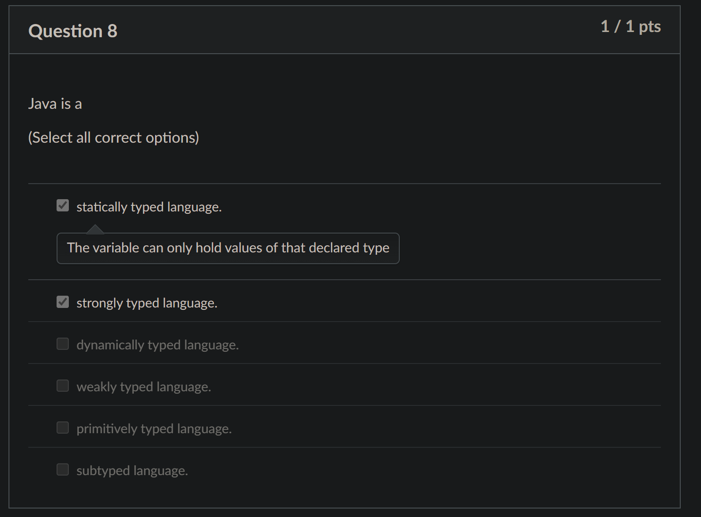

# Diagnostic Quiz

## Problems

### 8. Statically, Dymically, Strongly or Weakly Typed Language

<figure><figcaption></figcaption></figure>

Java is:



#### **Statically typed**

This means _the variable can only hold values of the declared type._



#### **Strongly typed**

This means everything needs to make sense, a.k.a if there are any problems with the program, it is not due to the type. For example, _no implicit conversion is allowed_


```java
int x = 10;
double y = 3.14;
int z = x + y; // Error: Cannot directly add double to int without casting
```


This code snippet will generate a **compilation error**.



### 15. Four type conversion

## Tips
