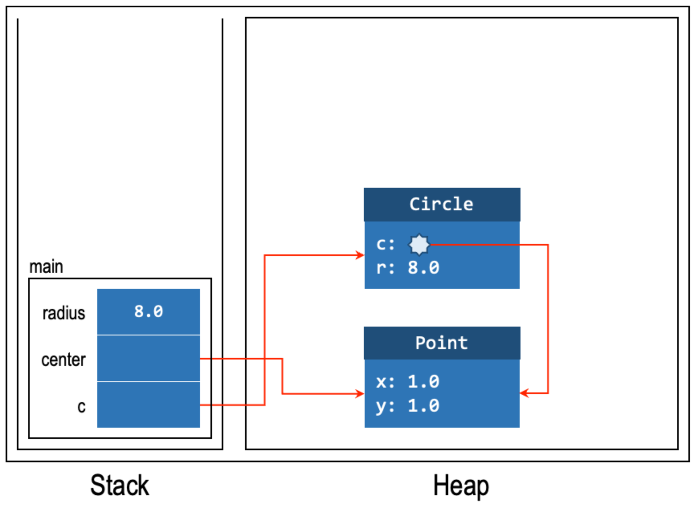
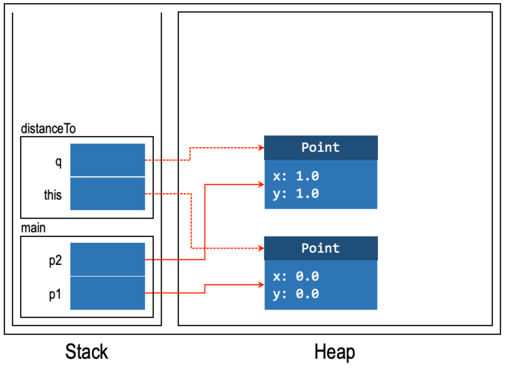

# Lec 02 - Class Instance/Methods, Inheritance

## Information Hiding

### A Problem

In the last lecture, we have introduced the idea of [_abstraction barrier_](../lec-01-compiler-types-classes-objects/#abstraction-barrier)_._ Above the abstraction barrier is the **client**, and as usual, the client shouldn't modify any content below the _abstraction barrier_ since it belongs to the **implementer** unless the implementer allows to do so.

For example, we have a `Circle` class, an object `c` initialized from this class, and the **client** wants to set the `r` (one of the fields) to a certain number, let's say 10. (`c.r = 10`). But now, the **implementer** says the `r` field in the class will be changed to `d` (diameter). Then, bad things happen since calling `c.r = 10` will generate a **compilation error!** To fix it, the client have change every `c.r` to `c.d` ! This is tedious!

This **problem** is caused exactly by the **client**'s breaking the _abstract barrier_ to access the field, which should belongs to the **implementer**.

### `public` and `private`

To solve this problem, many Object-oriented languages allow programmers to **explicitly** specify if a **field** or a **method** can be accessed from outside the abstraction barrier. Java, for instance, supports `private` and `public` access modifiers. Their difference are summarized in the table below

|   Accessed from   | private | public |
| :---------------: | :-----: | :----: |
|  Inside the class |   Yes   |   Yes  |
| Outside the class |    No   |   Yes  |

Such a mechanism to protect the abstraction barrier from being broken is called _data hiding_ or _information hiding_. This protection is enforced by the _compiler_ at compile time.


Usually, we make fields as `private` becasue of the _information hidden_ principle, unless we have proper reason to make it `public` to the client, such as it is a constant, like `Math.PI`, which will we see more in [_class fields_](./#class-field).


### Constructor

But now, a new problem emerges. If we define all our fields in the class to be `private`, then how we can initialize them? :joy: To solve this problem, it is common for a class to provide methods to **initialise these internal fields**.

> A method that initializes an object is called a _**constructor**._


So, basically, we can see _constructor_ as a way to "set up" our object.


A constructor method is a special method within the class. It **cannot be called directly** but **is invoked automatically when an object is instantiated**. In Java, a constructor method _has **the same name as the class**_ and _has **no return type**_. A constructor can take in arguments just like other functions. Let's add a constructor to our `Circle` class:


```java
class Circle {
  private double x;
  private double y;
  private double r;

  public Circle(double x, double y, double r) {
    this.x = x;
    this.y = y;
    this.r = r;
  }

  public double getArea() {
    return 3.141592653589793 * this.r * this.r;
  }
}
```


#### The `this` keyword

As you have noticed, the code above introduces the `this` keyword. `this` is a **reference variable** that [refers back to the **calling object itself**](#user-content-fn-1)[^1]. It can be used to distinguish between two variables of the same name. In the example above, `this.x = x` means we want to set the field `x` of this object to the parameter `x` passed into the constructor.


Notice that in the `getArea()`, we have replaced `r` with `this.r`. Usually, it is a good practice to refer to fields through `this` because it differs the field from local variables or parameters, thus making our code easier to understand.


#### Default Constructor

If have class has **no** explicit constructor, then a default constructor will be added automatically at **compile time**. The default constructor has no parameter and has no code written for the body.


Note that in a class, there may exist many constructors, but:

1. They have the same method name, which is the same as the class name
2. They have different number of parameters


## Tell, Don't Ask

### Accessors and Mutators

Similar to providing [constructors](./#constructor), a class can also provide methods to **retrieve or modify** the properties of the object. These methods are called the _accessor_ (or _getter_) or _mutator_ (or _setter_).

For example, for our `Circle` class, we have the following _accessors_ and _mutators_.

| Fields | Accessors | Mutators |
| ------ | --------- | -------- |
| `x`    | `getX`    | `setX`   |
| `y`    | `getY`    | `setY`   |
| `r`    | `getR`    | `setR`   |

#### Advantage

The use of _accessors_ and _mutators_ has the following advantages over using the `public` keyword to make the field public directly. By having an accessor and a mutator:



We are **adding a layer of abstraction.** For instance, we can still rename a field without affecting the client.

**Why?** This is because we are calling the methods (a.k.a _accessors_ and _mutators_) to retrieve or modify the fields in the object, so as long as we don't change the method name, changing the **field name** merely in class won't affect the client's code.



We may be able to peform some **checks on the mutator.**

This is because sometimes user may set invalid or not-compatible values to the fields. However, by using a mutator, we can do some checks to prevent this kind of bug-prone behavior. For example,


```java
public void setR(double r) {
  if (r > 0) {
    this.r = r;
  } else {
    // handle error
  }
}
```




#### Disadvantage

However, the use of _accessors_ and _mutators_ is **not** an error-free solution. For example, when the client is calling an _accessor_, the client should know the type that will be returned, a.k.a, the type of the certain field in the class. However, the client should **not** know this kind of information since it belongs to the implementer! So, here comes the first problem:

> 1. Information Leak

The problem does not stop here. Let's say if the implementer wants to change the type of the field, which will also change the return type of the _accessors_, and the client doesn't know that! This is very dangerous because likely the code will generate a **compilation error**!

> 2. May genertae compilation error

For example, let's use the following code regarding our `Circle` class as an example:


```java
int cX = c.getX(); // Suppose getX() will return an double, same for the following
int cY = c.getY();
int r = c.getR();
boolean isInCircle = ((x - cX) * (x - cX) + (y - cY) * (y - cY)) <= r * r;
```


As we have seen earlier in the [subtype](../lec-01-compiler-types-classes-objects/#subtypes), `int` is the **subtype** of `double`. Assign a `double` to a `int` is considered as [_narrowing type conversion_](../lec-01-compiler-types-classes-objects/#subtyping-between-java-primitive-types) and [it is **not allowed** without explicit casting](../lec-01-compiler-types-classes-objects/diagnostic-quiz.md#id-15.-widening-narrowing-type-conversion)! So, here we will get a **compilation error!**

***

So, the question comes, when should we use _accessors_ and _mutators_?

### The "Tell, Don't Ask" Principle

One guiding principle to whether the implementer should provide and whether the client should call the _accessor_ and _mutator_ is the "**Tell, Don't Ask**" principle. This principle suggests that we should **tell an object what to do**, **instead of asking an object for its state and then performing the task on its behalf**.

For example, in the example above, what we are trying to do is as follows:

<figure><figcaption></figcaption></figure>

Applying the "Tell Don't Ask" principle, a better approach would be to add a new `boolean` method in the `Circle` class,


```java
boolean contains(double x, double y) {
  return ((x - this.x) * (x - this.x) + (y - this.y) * (y - this.y)) <= this.r * this.r;
}
```


and let the client _tell_ the `Circle` object to check if the point is within the circle.


```java
boolean isInCircle = c.contains(x, y);
```


<figure><figcaption></figcaption></figure>

Now, the `Circle` class can change its internal structure (e.g., the type of the fields) without affecting the client.


1. In general, _a task that is performed only on the fields of a class should be implemented in the class itself._
2. For beginner OO programmers, it is better to **not define classes with any accessor and modifier** to the `private` fields and force yourselves to think in the OO way — to **tell an object what task to perform as a client, and then implement this task within the class as a method as the implementer**.


## Class Field

In our `Circle` class, we have a constant $$\pi$$ and this constant $$\pi$$ is universal and **does not really belong to any object** (The value of $$\pi$$ is same for every circle!). In C, we have the solution to define a global constant using the `define` keyword.

In Java, we can associate these _global_ values and functions with a _class_ instead of with an _object_. For instance. Java predefines a [`java.lang.Math`](https://docs.oracle.com/en/java/javase/11/docs/api/java.base/java/lang/Math.html) class that is populated with constants `PI` and `E` (for Euler's number $$e$$), along with a long list of mathematical functions.

To associate a method or a field with a class in Java, we declare them with the `static` keyword. We can additionally add the keyword `final` to indicate that the value of the field will not change and `public` to indicate that the field is accessible from outside the class. In short, the combination of `public static final` modifiers is used for constant values in Java.


```java
class Math {
  :
  public static final double PI = 3.141592653589793;
  :
  :
}
```


We call these `static` fields that are associated with a **class** as _class fields_ and fields that are associated with an **object** as _instance fields_. _Class fields_ are useful for storing pre-computed values or configuration parameters associated with a class rather than individual objects. `static` fields have **exactly one instance** of it throughout the lifetime of the program.


A `static` class field needs **not** be `final` and it needs **not** be `public`.


### Access Class Fields



**Import the certain class**

For example, if we want to use the `PI` constant defined in class `java.lang.Math`, we should first use the `import` keyword to import the `java.lang.Math` class


```java
import java.lang.Math;
```




**Use** `class.FIELD_NAME`  **to access the class field**

After importing the class, we can use `class.FIELD_NAME` to acccess the specific class field.


```java
public double getArea() {
  return Math.PI * this.r * this.r;
}
```





To access a _class field_. It is only allowed to use `class.FIELD_NAME`, we **cannot** use `object.FIELD_NAME` to access a `static` field inside an object!


## Class Method

Similar to a `static` field, a `static` method is associated with a class, not with an instance of the class. Such a method is called a _class method_.

A class method is always invoked without being attached to an instance, so it **cannot access its instance fields or call other of its instance methods**. The reference `this` has no meaning within a class method. Furthermore, just like a class field, a class method should be accessed through the class. For example, in our `Circle` class, we wish to assign a unique integer identifier to every `Circle` object ever created:

<pre class="language-java" data-line-numbers><code class="lang-java">class Circle {
  private double x;  // x-coordinate of the center
  private double y;  // y-coordinate of the center
  private double r;  // the length of the radius
<strong>  private final int id; // identifier
</strong><strong>  private static int lastId = 0; // the id of the latest circle instance
</strong>
  /**
   * Create a circle centered on (x, y) with a given radius
   */
  public Circle(double x, double y, double r) {
    this.x = x;
    this.y = y;
    this.r = r;
<strong>    this.id = Circle.lastId;
</strong><strong>    Circle.lastId += 1;
</strong>  }

  /**
   * Return how many circles have ever existed.
   */
<strong>  public static int getNumOfCircles() {
</strong><strong>    return Circle.lastId;
</strong><strong>  }
</strong>
   : 
}
</code></pre>


Note that all of the above are done privately **beneath the abstraction barrier**.


Other examples of class methods include the methods provided in `java.lang.Math`: `sqrt`, `min`, etc. These methods can be invoked through the `Math` class: e.g., `Math.sqrt(x)`.

### The `static` keyword

Recap that for static fields (i.e., class fields), we only have exactly **one instance** of it t**hroughout the lifetime of the program**. More generally, **a field or method with modifier** `static` **belongs to the class rather than the specific instance**. In other words, they can be accessed/updated (for fields, assuming proper access modifier) or invoked (for methods, assuming proper access modifier) **without even instantiating the class**.

### More on `this`

As we have seen `this` [first time](./#the-this-keyword) in the [constructor](./#constructor), let's talk more about `this` with `static` methods.

As a follow up, if we have not instantiated a class, no instance of that class has been created. The keyword `this` is meant to refer to the _current instance_, and if there is no instance, the keyword `this` is not meaningful. Therefore, within the context of a `static` method, Java actually **prevents the use of** `this` **from any method with the** `static` **modifier**.


```java
  public static int getLastId() {
    return this.id; 
  }
  // This will generate an error
```


The opposite is **not** true. We can access class fields from non-static methods.

### The `main()` method

The most common class method you will use is probably the `main` method.

Every Java program has a class method called `main`, which serves as the **entry point** to the program. To run a Java program, we need to tell the JVM the class **whose** `main` **method should be invoked first**. In the example that we have seen,


```bash
java Hello
```


will invoke the `main` method defined within the class `Hello` to kick start the execution of the program.

The `main` method must be defined in the following way:


```javascript
public static final void main(String[] args) {
}
```


## Composition

Till now, in our class, we only use the [primitive type](../lec-01-compiler-types-classes-objects/#primitive-types-in-java) as the _fields_. However, it is advised and a good practice to use other classes (a.k.a [reference type](../lec-01-compiler-types-classes-objects/#reference-types-in-java)) in the _fields_. And this technique is called _composition_.

Basically, the main **advantage** of using _composition_ is that it adds more **abstraction**. Recall that we wish to **hide the implementation details as much as possible**, protecting them with an abstraction barrier, so that **the client does not have to bother about the details and it is easy for the implementer to change the details**.


As you will see later also, what _composition_ does it to implement a **"has-a"** relationship.


## Heap and Stack

### Stack

The _stack_ contains variables. Bascially, _stack_ is the region where all **variables** (including **primitive types** and **object references**) are allocated and stored.&#x20;

#### Stack Frame

_Stack frame_ is usually called _call frame_. Recall that the same variable names can exist in the program as long as they are in different methods. This means that **the variables are contained within the&#x20;**_**call frames**_. Call frames are **created** when we **invoke a method** and are removed when the method completes.

And usually, when an **instance** method is called, a _stack frame_ is created and it contains:

1. the `this` reference
2. the method arguments
3. local variables within the method

When a **class** method is called, the _stack frame_ does not contain the `this` reference.


1. Instance and class fields are **not** variable. As such, fields are not in the stack.
2. If we make multiple nested method calls, as we usually do, the stack frames get stacked on top of each other.


### Heap

The heap stores dynamically allocated objects. To put it simply, **whenever you use the keyword `new`, a new object is created in the heap**.

An object in the _heap_ contains the following information:

* Class name.
* Instance fields and the respective values.
* Captured variables (more on this in later units).

### Stack and Heap Diagram

#### Example One - Object Reference

For the following code:


```java
Circle c;
Point center;
double radius;
radius = 8;
center = new Point(1, 1);
c = new Circle(center, radius);
```


Its stack and heap diagram should look like as follows:

<figure><figcaption></figcaption></figure>


Note that after Line 6, the field `c` inside the `Circle` class is referenced to the `Point` object, not the `center` variable!


#### Example Two - Call Method

For the following code,


```java
Point p1 = new Point(0, 0);
Point p2 = new Point(1, 1);
p1.distanceTo(p2);
```


Its stack and frame diagram should look like as follows:

<figure><figcaption></figcaption></figure>

### Summary

To summarize, Java uses _call by value_ for primitive types, and [_call by reference_](#user-content-fn-2)[^2] for objects.


Unlike in C, In Java, we don't have to manage our memory manually, the JVM has a _garbage collector_ that does all this stuff for us!


## Inheritance

Recall the concept of _subtyping._ We say that $$S<:T$$ if any piece of code written for type $$T$$ also works for type $$S$$.

Now, let's use the example of `Circle` class. Suppose we want to **add** a color to the `Circle` class to make it a `ColoredCircle`. Now, we may find that all the methods and properties within the `Cricle` class should apply to `ColoredCircle` as well! So, we can think `ColoredCricle` as a _subtype_ of `Circle`.

### Inheritate from a class

We now show you how we can introduce this _subtype_ relationship in Java, using the `extends` keyword. We can implement our `ColoredCircle` class this way:

<pre class="language-java" data-line-numbers><code class="lang-java">class ColoredCircle extends Circle {
  private Color color;

  public ColoredCircle(Point center, double radius, Color color) {
<strong>    super(center, radius);  // call the parent's constructor
</strong>    this.color = color;
  }
}
</code></pre>

We have just created a new type called `ColoredCircle` as a class that **extends** from `Circle`. We call `Circle` the _parent class_ or _superclass_ of `ColoredCircle`; and `ColoredCircle` a _subclass_ of `Circle`.

Line 5 of the code above introduces another keyword in Java: `super`. Here, we use `super` to call the **constructor** of the superclass, to initialize its center and radius.


We can think of inheritance as a model for the "_**is a**_" relationship between two entities. And when to use _inheritance_ and when to use _composition_ depends on the following rule:

> _Use composition to model a **has-a** relationship; and inheritance for an **is-a** relationship_. _Make sure inheritance preserves the meaning of subtyping_.


### Run-Time Type

For the following code:


```java
Circle c = new ColoredCircle(p, 0, blue); // OK
```


Recall that `Circle` is called the **compile-time type** of `c`. Here, we see that `c` is now referencing an object of the subtype `ColoredCircle`. Since this assignment happens during **run-time**, we say that the _run-time type_ of `c` is `ColoredCircle`. The distinction between these two types will be important later.

## Overriding

Before we talk about overriding, let's introduce another very important point in Java, that is:

> In Java, **every class** that does not extend another class inherits from class `Object` implicitly. `Object` is, therefore, the "ancestor" of **all classes** in Java and is at the root of the class hierarchy.&#x20;

The `Object` class provides useful common methods to all objects, below are two of them:

1. `equals(Object obj)`, which checks if two objects are equal to each other, and
2. `toString()`, which returns a string representation of the object as a `String` object.

Among them, the second method is quite interesting and explains why _Java allows_ [_"addition"_](#user-content-fn-3)[^3] _on string and integer,_ which was covered in [Lec 01](https://wenbo-notes.gitbook.io/cs2030s-notes/lec-tut-lab-exes/lecture/lec-01-compiler-types-classes-objects#type-checking-with-a-compiler). For example,


```java
Circle c = new Circle(new Point(0, 0), 4.0);
String s = "Circle c is " + c; // s will be "Circle c is Circle@1ce92674"
```


### Customize `toString` method

We may note that `Circle@1ce92674` is not user-friendly so that we want customize it. To do so, let's define our own `toString` method in `Circle` to _override_ the `Object::toString()`. This technique is called _Overriding_.


```java
import java.lang.Math;

/**
 * A Circle object encapsulates a circle on a 2D plane.  
 */
class Circle {

  // ...
  
  /**
   * Return the string representation of this circle.
   */
  @Override
  public String toString() {
    return "{ center: " + this.c + ", radius: " + this.r + " }";
  }
}
```


From this example, we can see that _inheritance_ is not only good for extending the behavior of an existing class but through method _overriding_, we can _alter_ the behavior of an existing class as well.


**Using** `super` **to access overriden methods**

After a subclass overrides a method in the superclass, the methods that have been overridden can still be called, with the `super` keyword. For instance, the following `Circle::toString` calls `Object::toString` to prefix the string representation of the circle with `Circle@1ce92674`.


```java
@Override
public String toString() {
      return super.toString() + " { center: " + this.c + ", radius: " + this.r + " }";
}
```



[^1]: This is because, usually, we use `this` keyword inside the methods. And usually, methods are called using `object.method()`, so here "**the calling object itself"** refers to the "object" in front of the `.`.

[^2]: Alternatively, you can think of Java as always using _call by value_. It's just that the value of a reference is, in fact, just a reference.

[^3]: The formal notation is concatenation.
